# Opening {background-color="#1C6D72"}

<!--
     DRAFT OUTLINE — v0.1. Keep this comment after the first heading: any
     content (even a comment) between the YAML and the first heading renders
     as a stray blank slide.

     Design model (per latest direction):
       - DENSE slides. The detail lives on the slide; you skim live, the
         audience reads later from the hosted HTML at charlespeterson.dev/oarc_llm_talk.
       - SCROLLABLE ARTIFACT BLOCKS: full SKILL files, long AI transcripts, and
         oversized output go in scroll-box code fences. They stay inside the
         slide, scroll internally, and keep Quarto's copy button. (HTML only;
         a static PDF clips them.)
       - No lean-live / hidden-appendix split. Reference depth folds into the
         main deck; a short "Reference" tail at the end holds true overflow.

     Every PLACEHOLDER comment marks something that needs YOUR real content:
     a screenshot, a real SKILL.md, real AI output, or a number you haven't set.
-->


## What this talk is about

::: {.text-md}
Most AI talks explain how LLMs *work*. This one is about making them work *for you*: agents, tools, skills, and models you run on your own terms. 

This mostly covers my personal setup and workflow; yours will look different. The hardest part of AI isn't learning how it works, it's fitting it into your actual work.

:::

::: {.text-sm}
:::: {.columns}
::: {.column width="50%"}

**Covered:**

- Running models where *you* control the data
- Agents: AI that *does* tasks on your machine, not just chats
- Tools and skills, and matching their design to model size
- A broad tour of the AI app landscape

:::
::: {.column width="50%"}

**Not covered:**

- How transformers work
- A hello-world style tutorial
- Detailed app tutorials

:::
::::

::: {.highlight-box}
Local AI, but the practices come first: good hygiene for frontier models, load-bearing for local ones. A small model has less reasoning to paper over what you didn't specify.
:::
:::


## General by default. Yours with context. {.slide-flow}

::: {.text-md}
Out of the box, every model has general knowledge from the public internet and zero knowledge of you: your files, your workflows, your way of doing things. Same model, same one-line request:

```{.bash}
Archive last month's simulation runs and free up scratch.
```

:::: {.columns}
::: {.column width="50%"}
::: {.accent-box}
**Given nothing**

A plausible script that guesses everything you didn't say: invented paths, a generic `tar` loop, delete before verify. Looks great in a demo. You read every line before you dare run it.
:::
:::
::: {.column width="50%"}
::: {.highlight-box}
**Given your context, instructions, and tools**

Knows where your runs live, what your retention policy says, where archives go, and that nothing is deleted until checksums pass. The work comes out your way.
:::
:::
::::

::: {.highlight-box}
**Context is the difference between toy and tool.** A cleverer prompt fixes one answer; handing it your setup once fixes every task after it. The model is fixed the day it ships; what makes it *yours* is what you wrap around it.
:::
:::


## You are the manager, the AI is the worker

::: {.text-md}
:::: {.columns}
::: {.column width="58%"}

AI can be a great worker: capable and fast. But it doesn't decide what's in scope or what counts as done. That's the manager's job.

- You: clear task → AI: done well
- You: vague task → AI: fills the gaps its own way, confidently

**You're in charge of the scope.** You know your workflow. Let AI do the work you specify.

:::
::: {.column width="42%"}
::: {.accent-box}
If you can't see *how* the AI did the work, you can't tell whether it did the right thing.

The work *looks* finished, but the gaps were filled with its assumptions, and you inherit work you don't understand.
:::

::: {.callout-note appearance="simple"}
### The discipline
Specify the how where it matters; make the AI show its work. Tools and skills pin the "how" down so it doesn't go off on its own.
:::
:::
::::
:::

# What Are We Even Talking About? {background-color="#1C6D72"}


## What we call "AI" {.slide-flow}

::: {.text-md}
"ChatGPT," "AI," and "the model" are different things. Pulling them apart unlocks the rest of this talk.
:::

::: {.text-sm}
:::: {.columns}
::: {.column width="33%"}
::: {.highlight-box}
**The LLM**
:::
Text in, text out. No memory, no tools, no actions. The "brain."

Under the hood it's just numbers: the *weights*.

As a user, you never talk to the LLM directly.

GPT-5.5, Claude, Qwen, Llama, etc.
:::
::: {.column width="33%"}
::: {.highlight-box}
**The App**
:::
Wraps the model. Decides what it sees, what tools it has, how output renders.

This is what you interact with; the app talks to the LLM for you.

ChatGPT, Claude.ai, LM Studio.
:::
::: {.column width="33%"}
::: {.highlight-box}
**The Agent**
:::
LLM in a loop that can call tools and act on results. Not magic: pick tool → run → read result → decide next.
:::
::::
:::


## The models {.slide-data}

::: {.text-sm}
:::: {.columns}
::: {.column width="50%"}
::: {.highlight-box}
**Frontier — on the provider's cloud**
:::

The best (and largest) models. Typically closed-weight: you can only reach them through the provider.

- **OpenAI** — GPT-5.5, Codex-5.5
- **Anthropic** — Fable, Opus, Sonnet, Haiku
- **Google** — Gemini
- **xAI** — Grok

Best quality, zero setup. You rent access; the weights never leave their cloud.
:::
::: {.column width="50%"}
::: {.highlight-box}
**Open-weight — run anywhere you control**
:::

You download the model (the weights) and run it on your own hardware. Typically smaller, but with the right tools and skills they still do great work.

- **Alibaba** — Qwen
- **Meta** — Llama
- **NVIDIA** — Nemotron
- **DeepSeek** — DeepSeek
- **Google** — Gemma
- also Mistral, Kimi

(Some providers host open-weight models too, so you don't have to run them yourself.)

:::
::::
:::

## Three shapes of a call: chat, one tool, the loop {.slide-flow}

::: {.text-sm}
The model never changes. What changes is *how many times the app calls it* and *what it can reach in between.*
:::

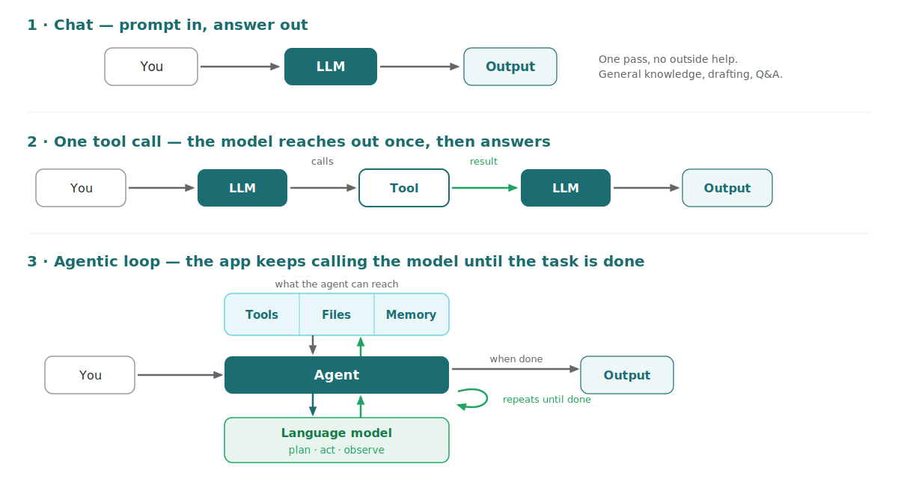


## The Agent: an LLM in a loop, with tools {.slide-flow}

::: {.text-sm}
An agent is just: **LLM → picks a tool → tool runs → result goes back → LLM decides the next step.** Repeat until done. The smallest possible example:
:::

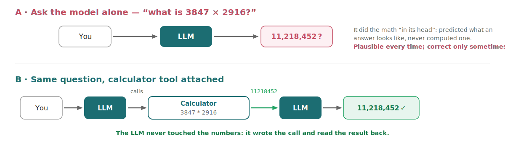

::: {.text-md}
::: {.highlight-box}
**The model didn't get smarter. It stopped guessing.** It doesn't need to be good at arithmetic, just good enough to call the calculator and relay the result. Swap in any tool from this talk.
:::
:::


## The Model, The Engine, The App {.slide-cluster}

::: {.text-sm}

Pick each layer independently. That's the whole point.

::: {.highlight-box}
**App — what you interact with**
:::

- Chat: ChatGPT, Claude.ai, Open WebUI, LibreChat, AnythingLLM
- Agent (app + tools + a loop): Claude Code, Codex, OpenCode, openwork, Aider

::: {.highlight-box}
**Inference engine — Software that runs models**
:::

- Ollama, vLLM, llama.cpp, Triton, LM Studio's built-in engine. Only needed when *you* host.

::: {.highlight-box}
**Model — the brain**
:::

- Frontier (rent, provider-hosted): GPT-5.5, Claude Sonnet / Opus, Gemini
- Open-weight (own, run anywhere): Llama, Qwen, DeepSeek, Gemma, Nemotron

:::


## Who brings the model? {.slide-data}

::: {.text-sm}

You never talk to an LLM directly: an **app** wraps it and decides what the model sees and reaches. One question sorts every product:

:::: {.columns}
::: {.column width="50%"}
::: {.accent-box}
**Brings its own model (locked)**
:::

- ChatGPT → GPT-5.5
- Claude.ai → Sonnet / Opus (local models experimental)
- Gemini app → Gemini

A great model, no choice. The brain is fixed.
:::
::: {.column width="50%"}
::: {.highlight-box}
**You bring the model (pluggable)**
:::

- Open WebUI, LibreChat, AnythingLLM → OpenAI API *or* a local engine
- Claude Code, Codex, OpenCode → run against the model you point them at
- LM Studio → all three layers in one GUI, your choice of open model

Same app, swap the brain per task.
:::
::::
:::

::: {.callout-note appearance="simple"}
### The two that keep moving between boxes
**LM Studio** bundles engine + chat + tools in one app. **Ollama** is engine-only, no UI, so other apps point at it.
:::


## Two kinds of app: one answers, one acts {.slide-flow}

::: {.text-md}
:::: {.columns}
::: {.column width="50%"}
::: {.highlight-box}
**Chat apps — answer and discuss**
:::

Good for thinking, not doing:

- General knowledge and explanations
- Brainstorming, project and architecture design
- Drafting and rewriting text
- Talking a problem through before you build

The model replies; you copy what you need. It can't see your files or run anything.
:::
::: {.column width="50%"}
::: {.highlight-box}
**Agent apps — do the work**
:::

Good for doing, not just discussing:

- Run tools and commands, multi-step tasks
- Read and write your actual files and folders
- Work against your repo, your data, your machine
- You hand it context; it acts and reports back

The difference isn't the model. It's whether the app can reach your stuff and take actions.
:::
::::
:::


## Chat apps: the ones you already know {.slide-data}

::: {.text-sm}

The frontier chat apps: cloud, zero setup, model locked to the vendor. Great for general knowledge, explanations, and planning a project before you build.

:::: {.columns}
::: {.column width="33%"}
::: {.center-content}
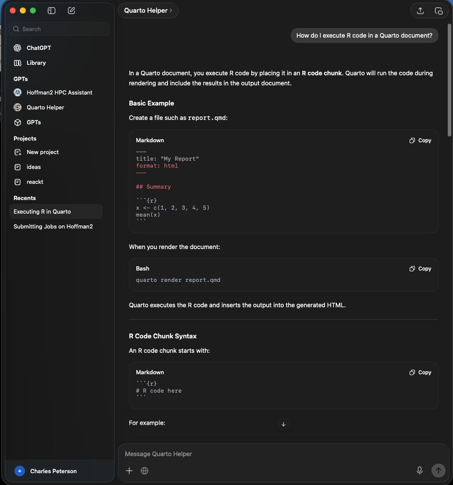
:::
**ChatGPT** → GPT-5.5
:::
::: {.column width="33%"}
::: {.center-content}
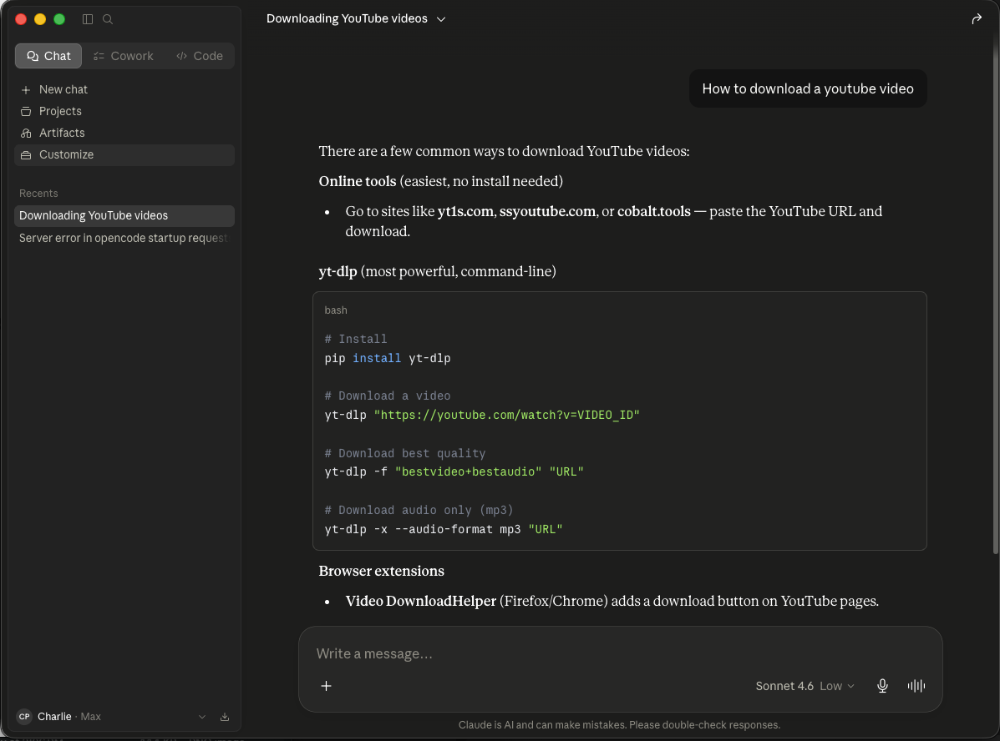
:::
**Claude.ai** → Sonnet / Opus
:::
::: {.column width="33%"}
::: {.center-content}
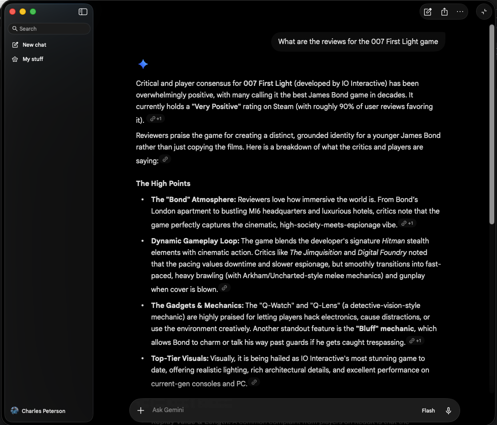
:::
**Gemini** → Gemini
:::
::::

**Tools, but a short list:** web search, math and code, reading uploads, creating files to download. **Can't reach:** a local model, your filesystem, or tasks on your machine.

:::


## Desktop agent apps {.slide-compute}

::: {.text-sm}

GUI agents on your machine: they open your folders, run tools, and do multi-step work while you approve each step. (Arrow through four.)

:::: {.columns}
::: {.column width="55%"}
::: {.r-stack}
::: {.fragment .fade-out fragment-index=0}
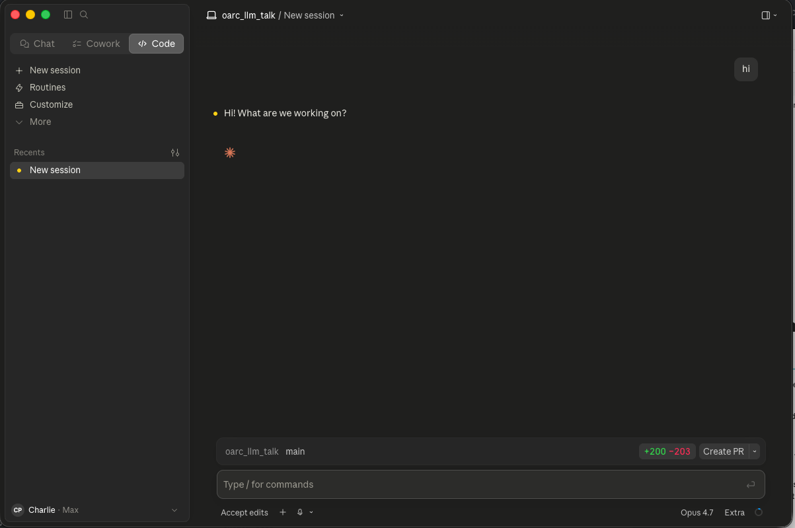
:::
::: {.fragment .fade-in-then-out fragment-index=0}
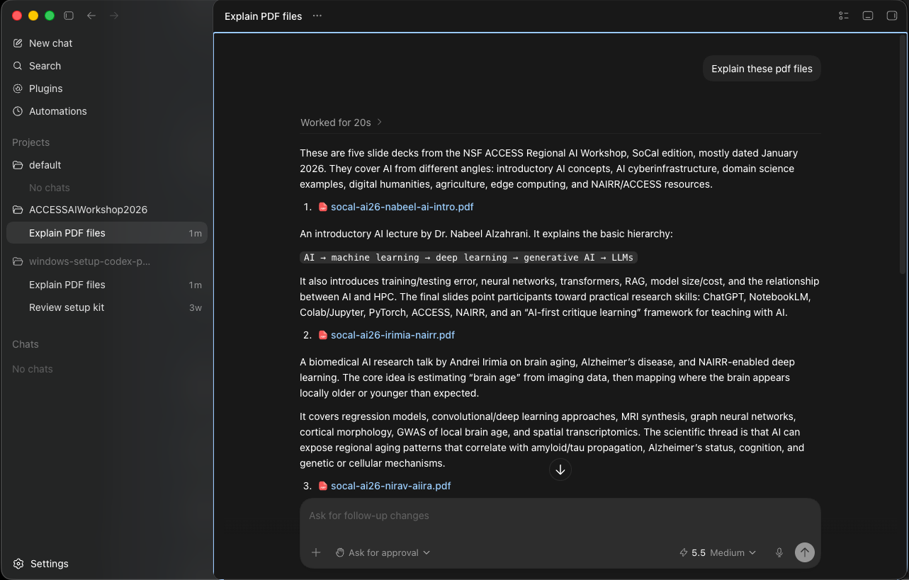
:::
::: {.fragment .fade-in-then-out fragment-index=1}
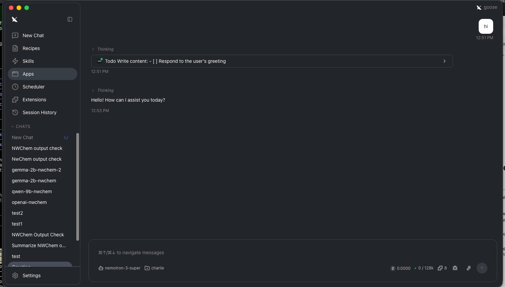
:::
::: {.fragment .fade-in fragment-index=2}
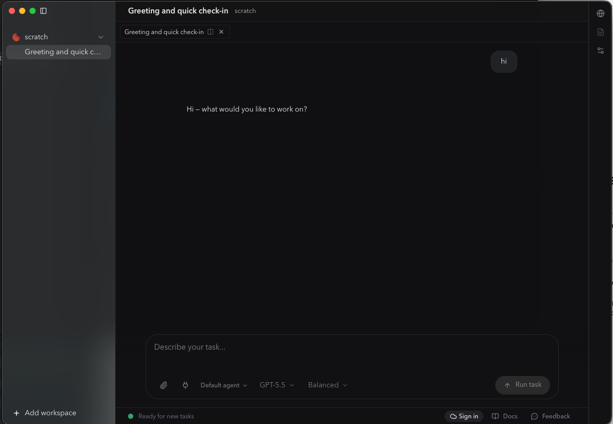
:::
:::
:::
::: {.column width="45%"}
::: {.r-stack}
::: {.fragment .fade-out fragment-index=0}
#### Claude Code · Anthropic

- *Vendor app, for Claude* — Chat, Cowork, and Code modes; sessions, routines, diff review and PR creation built in.
- **Models:** sharpest on Claude; can also point at any OpenAI-compatible endpoint (LM Studio, Ollama, vLLM).
- [Docs →](https://claude.com/claude-code)
:::
::: {.fragment .fade-in-then-out fragment-index=0}
#### Codex · OpenAI

- *Vendor app, for GPT/OpenAI* — skills and plugins, sandboxed execution, local and cloud tasks from one window.
- **Models:** sharpest on OpenAI models; also drives a local OpenAI-compatible server.
- [Docs →](https://openai.com/codex)
:::
::: {.fragment .fade-in-then-out fragment-index=1}
#### Goose · Block, open source

- *Model-agnostic* — one of the deepest MCP integrations anywhere; recipes, skills, a scheduler, 70+ extensions.
- **Models:** 15+ providers, frontier or local — pairs well with open-weight models.
- [Docs →](https://goose-docs.ai)
:::
::: {.fragment .fade-in fragment-index=2}
#### openwork · open source

- *OpenCode in a window* — a desktop GUI on the OpenCode engine; workspaces, a visual task timeline, per-action permission prompts.
- **Models:** any provider with your own keys, frontier or local.
- [Docs →](https://github.com/different-ai/openwork)
:::
:::
:::
::::

::: {.text-sm}
**Approve before it acts:** you see each tool call and OK it. The AI proposes; you approve.
:::
:::

## CLI agent apps: same power, terminal-native {.slide-code}

::: {.text-sm}

The same agents, in your terminal: scriptable, composable, and they run anywhere you can SSH, including a cluster login node. (Arrow through six.)

:::: {.columns}
::: {.column width="55%"}
::: {.r-stack}
::: {.fragment .fade-out fragment-index=0}
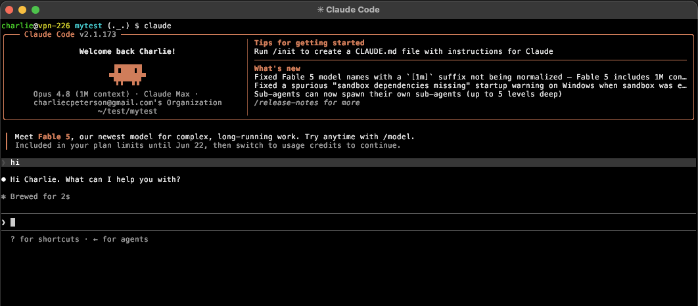
:::
::: {.fragment .fade-in-then-out fragment-index=0}
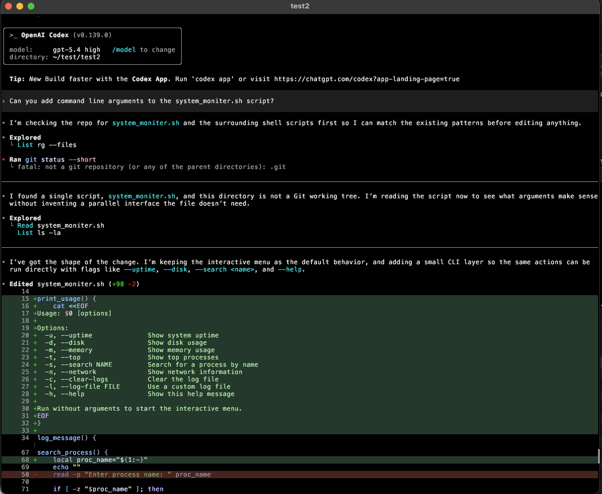
:::
::: {.fragment .fade-in-then-out fragment-index=1}
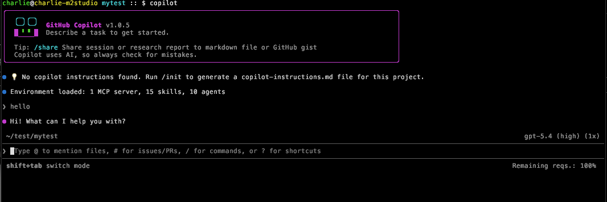
:::
::: {.fragment .fade-in-then-out fragment-index=2}
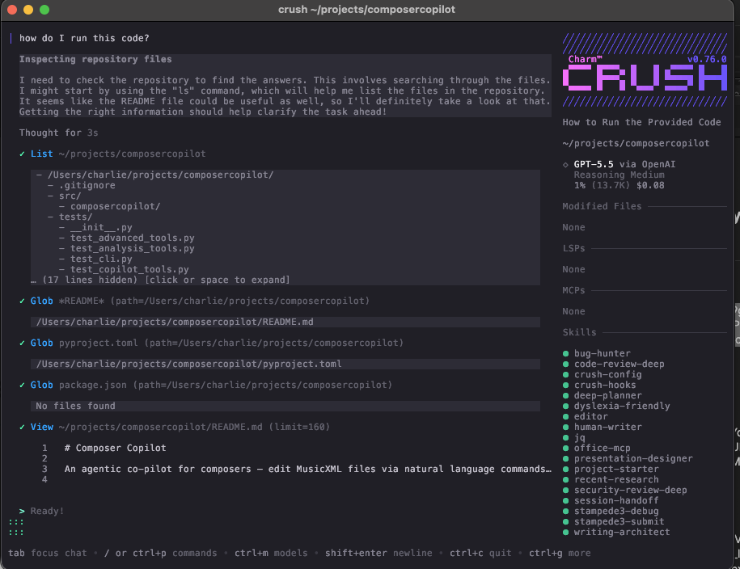
:::
::: {.fragment .fade-in-then-out fragment-index=3}
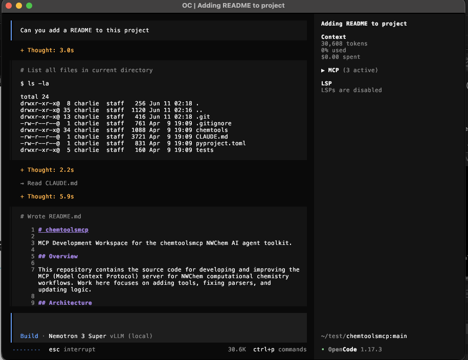
:::
::: {.fragment .fade-in fragment-index=4}
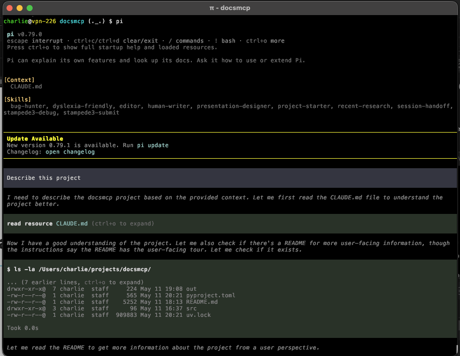
:::
:::
:::
::: {.column width="45%"}
::: {.r-stack}
::: {.fragment .fade-out fragment-index=0}
#### Claude Code · Anthropic

- *Vendor harness, tuned for Claude* — subagents, skills, hooks, plan mode, MCP.
- **Models:** sharpest on Claude; can also point at any OpenAI-compatible endpoint (LM Studio, Ollama, vLLM).
- [Docs →](https://claude.com/claude-code)

```bash
npm i -g @anthropic-ai/claude-code
claude
```
:::
::: {.fragment .fade-in-then-out fragment-index=0}
#### Codex · OpenAI

- *Vendor harness, tuned for GPT and the o-series* — sandboxed exec, tight OpenAI integration.
- **Models:** sharpest on OpenAI models; also drives a local OpenAI-compatible server.
- [Docs →](https://github.com/openai/codex)

```bash
npm i -g @openai/codex
codex
```
:::
::: {.fragment .fade-in-then-out fragment-index=1}
#### GitHub Copilot CLI · GitHub

- *Copilot in the terminal* — native repo context, plus MCP, skills, and agents.
- **Models:** provider-flexible (GPT and Claude) through your GitHub account.
- [Docs →](https://github.com/features/copilot/cli)

```bash
npm i -g @github/copilot
copilot
```
:::
::: {.fragment .fade-in-then-out fragment-index=2}
#### Crush · Charm

- *Model-agnostic, polished TUI* — LSP-aware, MCP, skills, swap models mid-session.
- **Models:** any provider, frontier or local, mixed freely.
- [Docs →](https://github.com/charmbracelet/crush)

```bash
brew install charmbracelet/tap/crush
crush
```
:::
::: {.fragment .fade-in-then-out fragment-index=3}
#### OpenCode · open source

- *Model-agnostic TUI* — MCP, custom agents, client/server split (drive it from another machine). It runs Example 3 later in this talk.
- **Models:** any provider, frontier or local; shown here on a local Nemotron via vLLM.
- [Docs →](https://opencode.ai)

```bash
curl -fsSL https://opencode.ai/install | sh
opencode
```
:::
::: {.fragment .fade-in fragment-index=4}
#### pi · open source

- *Model-agnostic toolkit* — unified LLM API + agent loop, extend it with npm/git packages.
- **Models:** any provider, frontier or local.
- minimal harness, DIY
- [Docs →](https://pi.dev)

```bash
curl -fsSL https://pi.dev/install.sh | sh
pi
```
:::
:::
:::
::::

::: {.text-sm}
**Two camps:** vendor harnesses (Claude Code, Codex), sharpest on their own models; provider-agnostic (Copilot, Crush, OpenCode, pi). Also out there: **Gemini CLI**, **Qwen Code**.
:::
:::


## AI is code: model makes text, the app decides actions {.slide-flow}

::: {.text-md}
:::: {.columns}
::: {.column width="58%"}

The fear is "I give AI access and it does whatever it wants." That's not the whole picture:

- The **LLM** only produces text, including a *request* to run a command. It has no hands.
- The **app** decides whether to *honor* that request: follow blindly, filter, ask you first, or refuse.
- "The AI went rogue" = an app executed model output with no guardrails
- An app can only perform actions its **tools** define. A tool that reads and writes email has no code path that deletes your photos.

:::
::: {.column width="42%"}
::: {.highlight-box}
**You don't have to trust it. You have to bound it.**

The real questions: what actions are possible in the app you're using, and what guardrails sit in front of them? The model is just text; the app is the boundary.
:::
:::
::::
:::

## The bigger threat: exposed apps, not the AI {.slide-compute}

::: {.text-md}
:::: {.columns}
::: {.column width="58%"}

My take: the bigger risk isn't "the AI does something bad." It's an attacker finding a vulnerability in the AI app itself and using it to get into your system. AI apps are popular and trending, which makes them a hot target.

Know what your AI setup exposes to the public internet, and protect it like anything else you run:

- **Open endpoints** — an inference server or chat UI on the internet with no auth (Ollama's port `11434`, coming up in the hands-on section)
- **Default configs** — web UIs stood up "to try it out" and never locked down
- **Stale installs** — these apps are young and move fast; last month's version can carry a published exploit

:::
::: {.column width="42%"}
::: {.highlight-box}
The AI part of your stack is new. The failure modes are the old classics: open ports, no auth, unpatched software.
:::

::: {.callout-tip appearance="simple"}
### Update on purpose
Agent apps and engines release frequently, partly *because* vulnerabilities are found frequently. Updating is part of running them.
:::
:::
::::
:::

# Where Things Run {background-color="#1C6D72"}

<!-- Sketch 14 -->
## "Local" doesn't mean "your laptop." It means you control the data flow.

::: {.text-xl}
The opposite of "local" isn't "cloud."
It's *someone else's terms of service*.
:::

::: {.text-md}
- Local can be: your laptop, a server in a closet, a private HPC partition, an EC2 you spun up yourself
- What makes it local: you know where the data goes and you control the infrastructure
- What makes it *not*: a provider's ToS you can't audit
:::

## Running the app and the model {.slide-data}

::: {.text-md}
**Where does the model run?** Provider-controlled (GPT-5.5, Claude, Gemini) or run-anywhere open weights (Qwen, DeepSeek, Llama, Mistral, Kimi).

**Where does the app run?** Provider-controlled (ChatGPT.com, Claude.ai) or local-capable (Open WebUI, LibreChat, LM Studio, Claude Code).
:::

::: {.text-sm}
|                              | **Provider model** (GPT, Claude, Gemini) | **Open-source model** (Qwen, DeepSeek, Llama) |
|------------------------------|------------------------------------------|-----------------------------------------------|
| **Provider app** (ChatGPT, Claude.ai) | ChatGPT on GPT-5.5: everything on OpenAI's terms | Rare — a few hosted-OSS chat services |
| **Local-capable app** (Open WebUI, Claude Code) | Open WebUI → OpenAI API: *your* UI, *their* model + data flow | Open WebUI → Ollama + Qwen on your server: everything you control |
:::

::: {.highlight-box}
Two separate choices, decided per task. Most modern apps let you point at any model endpoint: you don't have to accept what the app ships with.
:::

<!-- Sketch 17 -->
## Cloud frontier vs. local: an honest trade {.slide-data}

::: {.text-md}
:::: {.columns}
::: {.column width="50%"}
::: {.highlight-box}
**Cloud frontier** (GPT, Claude, Gemini)
:::

- Best models available, zero maintenance
- Data leaves your control; you accept the ToS
- Per-token costs add up at scale
- One incident affects millions; you're in the blast radius

:::
::: {.column width="50%"}
::: {.highlight-box}
**Local** (anywhere you control)
:::

- Full control of data, network, storage; no ToS, no per-token bill
- Works offline; outages that aren't yours don't touch you
- You maintain it (updates, hardware, debugging)
- OSS models are usually smaller; quality scales with your hardware

:::
::::
:::


# Tools and Skills {background-color="#1C6D72"}

<!-- Sketch 19-23 merged: tools and skills defined side by side. The three
     real SKILL.md artifacts that follow carry the depth. -->
## Tools do the work; skills shape how it's done {.slide-code}

::: {.text-sm}
:::: {.columns}
::: {.column width="50%"}
::: {.highlight-box}
**A tool: a capability you hand the model**
:::

A function the LLM can call. The model decides *when* to call it; the tool does the actual work.

- **Tools are just code:** deterministic functions that perform a task
- It stops guessing at things it's bad at: math, current data, your specific systems
- You encode the *correct way* once; it runs that way every time
- The answer comes from the tool, not the model's memory
- A smaller/local model can succeed; the thinking is in the tool

:::
::: {.column width="50%"}
::: {.highlight-box}
**A skill: when, why, and what to check**
:::

A packet of guidance: "when you're doing X, here's how to think about it, the conventions, what to check."

- **Skills are just markdown files:** instructions and rules for how the model should do a task (look for `SKILL.md`)
- If you copy-paste the same instructions into ChatGPT every time, that's a skill waiting to happen
- `CLAUDE.md` / `AGENTS.md` at a project root are skills loaded automatically: the project described once, so you don't re-explain it every chat
:::
::::

::: {.highlight-box}
Together they move the thinking from **runtime** (the model guesses) to **design time** (you decided). Hallucinations come from *gaps* the model has to fill; tools, skills, and context fill the gaps first.
:::
:::

<!-- Real skill artifact #1: the complete dyslexia-friendly SKILL.md
     (source: assets/dyslexia-friendly.md/). Re-wrapped to ~72 cols for the
     scroll-box; content unchanged. -->
## Example SKILL {.slide-code}

::: {.text-sm}
:::: {.columns}
::: {.column width="42%"}

This skill reformats every response to be dyslexia-friendly: short sentences, white space, one bold idea per paragraph.

- The **`description`** is how the agent knows *when* to load it: the user mentions dyslexia, "hard to read," "simpler layout"
- The **body** is the procedure: rules, tone, a worked example, and a checklist the model runs before answering
- No code, no training, no tools. A text file.


:::
::: {.column width="58%"}

::: {.scroll-box}
```markdown
---
name: dyslexia-friendly
description: >
  Format ALL responses to be dyslexia-friendly. Use this skill
  whenever the user mentions dyslexia, reading difficulties, or
  asks for easier-to-read output. Also trigger when the user says
  things like "hard to read", "easier format", "simpler layout",
  or "reading support". When active, every single response must
  follow these formatting rules — do not revert to standard
  formatting even for short replies.
---

# Dyslexia-Friendly Output Skill

When this skill is active, every response you write must follow
these rules. No exceptions, even for short answers.

## Core Formatting Rules

### Sentences and Paragraphs
- **Maximum 1–2 sentences per paragraph.** Then a blank line.
- **Maximum 15–20 words per sentence.** Split anything longer.
- Never write a wall of text. White space is your friend.
- One idea per paragraph. If you have two ideas, use two
  paragraphs.

### Words and Language
- Use the **simplest word that works.** Never use a long word
  when a short one fits.
- Avoid: "utilise" → use "use". "Commence" → use "start".
  "Sufficient" → use "enough".
- Spell out abbreviations the first time. Example: Artificial
  Intelligence (AI).
- Avoid double negatives. "Not impossible" → say "possible".

### Emphasis
- **Bold the single most important word or phrase in each
  paragraph.** Just one.
- Do not use italics. They are harder to read for many dyslexic
  readers.
- Do not use ALL CAPS for emphasis. Use bold only.
- Do not underline text (looks like a link).

### Lists
- When giving more than two items, always use a numbered or
  bulleted list.
- Never list items inline like: "first, second, and third."
- Keep each list item to one short sentence.
- Put a blank line between the intro sentence and the list.

### Structure
- Use clear, short headings to break up any response longer
  than 3 paragraphs.
- Put the most important information **first**, not at the end.
- If explaining steps, always use a numbered list. Never prose.
- Summarise the key point at the top, then explain below.

### What to Avoid
- No jargon unless you immediately explain it in plain language.
- No long quotes or dense blocks of copied text.
- No complex tables — if you must use one, keep it to 2–3
  columns max.
- No sarcasm or idioms that rely on tone (they don't land in
  text).

## Tone

Be warm and direct.

Get to the point immediately.

Do not pad responses with filler phrases like:
- "That's a great question!"
- "Certainly! I'd be happy to help."
- "It's important to note that..."

Just answer.

## Example: Before and After

**Standard response (avoid this):**
"It's worth noting that there are a number of different
approaches one might consider when attempting to address this
particular challenge, and the most appropriate solution will
naturally depend on a variety of contextual factors that are
unique to your specific situation."

**Dyslexia-friendly response (do this):**

There are a few ways to solve this.

The **best approach depends on your situation.**

Here are the main options:

1. Option A — fast, works for most cases
2. Option B — takes longer, but more thorough
3. Option C — best if you have extra time

## Quick Checklist (run this before every response)

- [ ] No paragraph longer than 2 sentences?
- [ ] No sentence longer than 20 words?
- [ ] One bold item per paragraph only?
- [ ] No italics used?
- [ ] Lists used instead of inline items?
- [ ] Simplest possible words chosen?
- [ ] Most important point stated first?
```
:::

:::
::::
:::

<!-- Real skill artifact #2: the with/without comparison. Captured outputs
     from assets/dyslexia-friendly.md/, re-wrapped for the scroll-boxes. -->
## Same model, same prompt: only the skill changed

::: {.text-sm}

"Explain how to bake a cheesecake," plain vs. with the skill. Both answers are *correct*; only one is readable by the person who asked. (Full outputs; they scroll.)

:::: {.columns}
::: {.column width="50%"}
::: {.accent-box}
**Without the skill**
:::

::: {.scroll-box .short}
```text
❯ Explain how to bake a cheese cake

⏺ Here's a reliable classic New York-style
  cheesecake. It's dense and creamy, and the
  technique matters more than the ingredient
  list.

  Ingredients

  Crust
  - 1½ cups graham cracker crumbs
    (about 10 full crackers)
  - 5 tbsp melted butter
  - 2 tbsp sugar

  Filling
  - 4 packages (8 oz each, 32 oz total) cream
    cheese, fully at room temperature
  - 1¼ cups sugar
  - 4 large eggs, room temperature
  - ⅔ cup sour cream
  - ⅔ cup heavy cream
  - 2 tsp vanilla
  - 2 tbsp flour (optional, helps prevent
    cracks)

  Method

  Crust. Mix crumbs, butter, and sugar; press
  firmly into the bottom of a 9-inch
  springform pan. Bake at 350°F (175°C) for
  10 minutes, then cool.

  Waterproof the pan. Wrap the outside of the
  springform in two layers of heavy foil.
  You're going to bake it in a water bath,
  and springform seams leak.

  Filling. Beat the cream cheese alone until
  completely smooth first, scraping the bowl.
  Add sugar, then eggs one at a time, then
  sour cream, heavy cream, vanilla, and
  flour. Beat on low and stop as soon as it's
  combined. Overbeating whips in air, which
  is what causes cracks and a soufflé-like
  rise-and-fall.

  Bake in a water bath. Pour filling over the
  crust. Set the springform in a roasting pan
  and pour hot water in to come about halfway
  up the sides. Bake at 325°F (160°C) for
  about 80–90 minutes. It's done when the
  outer two inches are set but the center 3–4
  inches still jiggle slightly. It will firm
  up as it cools.

  Cool slowly. Turn the oven off, crack the
  door, and leave the cake inside for an
  hour. Sudden temperature changes crack the
  top. Then cool on the counter, then
  refrigerate at least 4 hours, ideally
  overnight.

  The things that actually go wrong

  - Cold ingredients are the most common
    failure. Cold cream cheese never fully
    smooths out and you get lumps. Leave
    everything out for 2+ hours.
  - Cracks come from overbeating (air) or
    fast cooling (thermal shock), not from
    underbaking. The water bath and slow cool
    are your insurance.
  - Pulling it too late. A cheesecake that
    looks fully set in the oven is overbaked.
    The jiggly center is correct.

  Run a thin knife around the edge before
  releasing the springform so the contracting
  cake doesn't tear itself. Serve cold.
```
:::
:::
::: {.column width="50%"}
::: {.highlight-box}
**With the skill**
:::

::: {.scroll-box .short}
```text
❯ /dyslexia-friendly Explain how to bake a
  cheese cake

Skill(dyslexia-friendly)
  ⎿  Successfully loaded skill

⏺ How to Bake a Cheesecake

  This is a classic creamy cheesecake.

  The technique matters more than the recipe.

  ---
  What You Need

  For the crust:

  1. 1½ cups graham cracker crumbs
  2. 5 tbsp melted butter
  3. 2 tbsp sugar

  For the filling:

  1. 32 oz cream cheese (four 8 oz packs)
  2. 1¼ cups sugar
  3. 4 large eggs
  4. ⅔ cup sour cream
  5. ⅔ cup heavy cream
  6. 2 tsp vanilla
  7. 2 tbsp flour (helps stop cracks)

  ---
  One Rule First

  Take everything out of the fridge early.

  The cream cheese, eggs, and cream must be
  at room temperature.

  Cold cream cheese stays lumpy. Leave it
  out for 2 hours.

  ---
  Step 1: Make the Crust

  Mix the crumbs, butter, and sugar.

  Press it into the bottom of a 9-inch
  springform pan.

  Bake at 350°F (175°C) for 10 minutes.

  Then let it cool.

  ---
  Step 2: Wrap the Pan

  Wrap the outside of the pan in two layers
  of foil.

  You will bake it in water. The foil keeps
  water out.

  ---
  Step 3: Make the Filling

  Beat the cream cheese alone until smooth.

  Add the sugar. Then add the eggs one at a
  time.

  Add the sour cream, heavy cream, vanilla,
  and flour.

  Beat on low. Stop the moment it is mixed.

  Too much beating adds air. Air causes
  cracks.

  ---
  Step 4: Bake in Water

  Pour the filling over the crust.

  Put the pan inside a bigger roasting pan.

  Pour hot water into the big pan. Fill it
  halfway up the sides.

  Bake at 325°F (160°C) for about 80 to 90
  minutes.

  The edges should be set. The center should
  still jiggle.

  It firms up later as it cools.

  ---
  Step 5: Cool It Slowly

  Turn the oven off. Open the door a crack.

  Leave the cake inside for one hour.

  Fast cooling cracks the top. Go slow.

  Then cool it on the counter.

  Then chill it in the fridge for at least
  4 hours. Overnight is best.

  ---
  Three Things That Go Wrong

  1. Cold cheese makes lumps. Warm it up
     first.
  2. Cracks come from too much beating or
     fast cooling.
  3. Overbaking. A jiggly center is correct,
     not a mistake.

  ---
  One last tip.

  Run a thin knife around the edge before
  you open the pan.

  This stops the cake from tearing as it
  shrinks.

  Serve it cold.
```
:::
:::
::::
:::

<!-- Real skill #2: human-writer. Excerpts from the actual files in my config
     repo: SKILL.md (~300 lines) plus the two references/ files, shown as a
     synced r-stack so the folder structure itself is the point. -->
## human-writer: the skill that strips the AI voice {.slide-flow}

::: {.text-sm}
:::: {.columns}
::: {.column width="42%"}

Out of the box, every model writes with the same tells: "delve," "robust," "it's not X, it's Y," every paragraph the same length. This skill is my fix, grown over months of catching patterns. Not one file, a folder:

```text
human-writer/
├── SKILL.md
└── references/
    ├── anti-ai-patterns.md
    └── context-profiles.md
```

- **SKILL.md** — the always-on rules: no empty writing, throat-clearing, the AI rhythm
- **anti-ai-patterns.md** — the full vocabulary tables, three tiers of tells
- **context-profiles.md** — how strict per format: a LinkedIn post and an investor email get different rules

(Arrow through the three files.)

:::
::: {.column width="58%"}

::: {.r-stack}
::: {.fragment .fade-out fragment-index=0}
::: {.scroll-box}
```markdown
---
name: human-writer
description: >
  Use any time you generate or rewrite prose for the user —
  emails, documents, posts, proposals, any written content —
  so it reads like a sharp human wrote it: direct, specific,
  no AI tells. Also trigger on "make this sound less like AI",
  "clean this up", "rewrite this", "tighten this".
---

## The Prime Directive: no empty writing

Before drafting anything, ask: does this have actual
substance to work with?

If no, do not fill the gap with filler. Keep it short, or
ask one focused question first.

Never pad. Never perform. Never write a paragraph the
reader will finish and think "what did that actually say?"

### Throat-clearing

Cut every sentence whose only job is to announce that
something is about to be said:

- "I wanted to reach out because…" → just say why.
- "I'm writing to let you know that…" → just say it.
- "The purpose of this document is to…" → just start.

### Uniform rhythm

Human writing has uneven cadence. AI writing tends toward
every paragraph the same length, every sentence the same
weight, smooth transitions everywhere. Vary deliberately.

## The AI rhythm to avoid

1. Short punchy paragraph making a bold claim.
2. Dramatic transition or rhetorical question.
3. Universal statement about how this changes everything.
4. Moral takeaway or call to reflection.

Example (do not write like this):

> Technology isn't just changing how we work — it's
> redefining what work means.
>
> The question isn't whether to adapt. It's whether
> you're ready.

Every sentence is grammatically fine. The whole thing says
nothing. It could be about any technology, any industry,
any decade. That is the problem. Specificity is the
antidote.

## Final test

- Could a human have written this, or does it sound
  generated?
- Is every sentence doing something, or just filling space?
- Any throat-clearing openers? Boilerplate closings?
- Does this read like a LinkedIn post trying to be a TED
  talk? Start over.
```
:::
:::
::: {.fragment .fade-in-then-out fragment-index=0}
::: {.scroll-box}
```markdown
# Anti-AI Patterns — Full Reference
(references/anti-ai-patterns.md, ~380 lines)

## Vocabulary, by tier

- **Tier 1 — always flag.** 5–20× more common in
  AI text than human text. Replace on sight.
- **Tier 2 — flag in clusters.** Fine alone; two
  or more in one paragraph is a strong AI signal.
- **Tier 3 — flag by density.** Common words AI
  simply overuses.

### Tier 1 — always replace

| Replace             | With                     |
|---------------------|--------------------------|
| delve / delve into  | explore, dig into        |
| tapestry            | (describe the actual     |
|                     | complexity)              |
| leverage (verb)     | use                      |
| robust              | strong, reliable, solid  |
| seamless            | smooth, without friction |
| game-changer        | describe what changed    |
| utilize             | use                      |
| testament to        | shows, proves            |
| in order to         | to                       |
| due to the fact that| because                  |
| serves as           | is                       |
| boasts              | has                      |
| ...and ~70 more rows|                          |

### Tier 2 — flag when 2+ share a paragraph

| Replace    | With                        |
|------------|-----------------------------|
| harness    | use, take advantage of      |
| navigate   | work through, handle        |
| foster     | encourage, support, build   |
| streamline | simplify, speed up          |
| empower    | enable, let, allow          |
| myriad     | many (or give a number)     |
| ...        |                             |
```
:::
:::
::: {.fragment .fade-in fragment-index=1}
::: {.scroll-box}
```markdown
# Context Profiles — Tolerance Matrix
(references/context-profiles.md)

Different formats tolerate different patterns.

## Profiles

- `linkedin` — short-form; punchy fragments
  carry weight
- `blog` — default; all rules at full strength
- `technical-blog` — technical terms get a pass
- `investor-email` — high-trust; promotional
  language is the biggest risk
- `docs` — clarity over voice
- `casual` — only catch the worst offenders

## Tolerance matrix (excerpt)

| Rule          | linkedin | blog   | casual |
|---------------|----------|--------|--------|
| Em dashes     | relaxed  | strict | skip   |
| Bold overuse  | relaxed  | strict | skip   |
| Hedging       | strict   | strict | skip   |
| Rhetorical Qs | relaxed  | strict | skip   |
| Generic       | skip     | strict | skip   |
| conclusions   |          |        |        |

**Technical-blog exceptions:** `robust`,
`seamless`, `ecosystem` have legitimate
technical meaning there. Still flag: `delve`,
`tapestry`, `beacon`, `game-changer`.

## Auto-detection cues

- Under 300 words + hashtags → `linkedin`
- Code blocks, API references → `technical-blog`
- Salutation + fundraising language →
  `investor-email`
- No strong signals → `blog` (safest default)
```
:::
:::
:::

:::
::::
:::

<!-- human-writer with/without: captured outputs (Downloads/ucla-1.txt and
     ucla-2.txt), re-wrapped for the scroll-boxes; content unchanged. -->
## human-writer: same prompt, with and without {.slide-code}

::: {.text-sm}
:::: {.columns}
::: {.column width="50%"}
::: {.accent-box}
**Without the skill**
:::

::: {.scroll-box .shorter}
```text
❯ Can you write a half a page summary of
  the history of UCLA?

⏺ UCLA was founded in 1919 as the Southern
  Branch of the University of California,
  making it the second campus in the UC
  system after Berkeley. Initially located
  in downtown Los Angeles, the campus
  offered only two-year programs before
  being authorized to grant bachelor's
  degrees in 1922. The institution quickly
  outgrew its original site, and in 1929 it
  relocated to its current home in Westwood,
  a residential neighborhood on the western
  edge of Los Angeles, where its distinctive
  Romanesque Revival buildings were
  constructed on a 419-acre hilltop campus.

  Throughout the mid-20th century, UCLA
  expanded rapidly in both size and academic
  reputation. It established its graduate
  division in 1933 and its medical school in
  1951, cementing its identity as a
  comprehensive research university. The
  post-World War II era brought a surge of
  students through the GI Bill, fueling
  dramatic growth in enrollment and
  infrastructure. By the 1960s, UCLA had
  firmly established itself as one of the
  premier public universities in the United
  States, attracting world-class faculty and
  launching influential research programs
  across the sciences, humanities, and arts.

  The university also became a cultural and
  athletic powerhouse. Its sports programs,
  particularly under legendary basketball
  coach John Wooden, achieved unparalleled
  success — the men's basketball team won
  ten NCAA championships between 1964 and
  1975. Academically, UCLA faculty and
  alumni have gone on to win dozens of Nobel
  Prizes, and the campus played a
  foundational role in the development of
  the internet, as one of the original nodes
  of ARPANET in 1969.

  Today, UCLA enrolls over 45,000 students
  and is consistently ranked among the top
  public universities in the world. It
  remains a defining institution of Los
  Angeles, deeply woven into the city's
  intellectual, cultural, and civic life.
```
:::

**Weaker writing:** predictable phrasing, generic praise ("world-class faculty"), uniform paragraphs: the AI red flags.

:::
::: {.column width="50%"}
::: {.highlight-box}
**With the skill**
:::

::: {.scroll-box .shorter}
```text
❯ /human-writer Can you write a half a page
  summary of the history of UCLA?

⏺ UCLA opened in 1919 as the Southern Branch
  of the University of California, a modest
  teachers college on Vermont Avenue in Los
  Angeles with 1,500 students and a mandate
  to serve a growing city that the existing
  Berkeley campus was too far away to reach.
  The name fit the institution at the time:
  it was a branch, and everyone knew it.

  The move to Westwood in 1929 changed
  things. The new campus, built on 419 acres
  of donated land in the foothills between
  Beverly Hills and the Pacific, gave the
  institution room to become something other
  than an extension of Berkeley. Enrollment
  grew steadily through the Depression, and
  by the time World War II ended and the GI
  Bill sent hundreds of thousands of
  veterans back to school, UCLA was one of
  the largest universities in the country.
  The postwar decade was when it crossed
  from regional college to research
  university, adding doctoral programs,
  professional schools, and the first
  serious wave of faculty who could have
  gone anywhere.

  The University of California system
  formally recognized UCLA as a co-equal
  campus in 1952, ending the Southern Branch
  identity for good. Research funding
  accelerated through the Cold War. In 1969,
  a graduate student in Boelter Hall sent
  the first message over ARPANET, typing
  "lo" before the system crashed. It was
  supposed to be "login." The short version
  ended up being more fitting for something
  that would grow beyond any prediction.

  Today UCLA enrolls about 47,000 students,
  employs faculty who hold more than 100
  Nobel Prizes collectively across its
  affiliates and alumni, and runs a medical
  center that is consistently ranked among
  the best in the country. It is the most
  applied-to university in the United
  States, a position it has held for years.
  The institution Berkeley once considered
  its satellite became, by most practical
  measures, a peer.
```
:::

**Stronger writing:** a narrative arc (branch → peer), specific observations (the ARPANET "lo" crash), varied sentence length.

:::
::::

::: {.accent-box}
**Neither ships without your editing.** Without the skill, fixing the draft takes longer than writing from scratch. With it, the AI is a co-editor worth having.
:::
:::

<!-- Real skill #3: stampede3-submit (excerpts from the actual SKILL.md;
     queue table abridged to fit the box). The procedure-shaping example. -->
## stampede3-submit: a cluster encoded as a skill {.slide-cluster}

::: {.text-sm}
:::: {.columns}
::: {.column width="42%"}

My cluster-lore file for TACC's Stampede3. Things no general model knows reliably:

- The seven queues, their limits, and SU rates
- The partition decision flow: test on `skx-dev` first, the SPR memory trap
- `ibrun`, never `mpirun`; `--mem` is rejected; which filesystems are Lustre
- Where the agent must *stop*: `sbatch` is blocked from compute nodes; it writes, prices, and hands off

::: {.callout-tip appearance="simple"}
### The other kind of skill
The first two shaped the output. This one shapes the *procedure*: which queue, what never gets emitted, when to stop.
:::

:::
::: {.column width="58%"}

::: {.scroll-box}
```markdown
---
name: stampede3-submit
description: >
  Build a Slurm sbatch script for Stampede3 (TACC). Use when
  the user on Stampede3 asks to "run X on the cluster",
  "submit a job", "make a batch script", or "request N
  nodes/GPUs". Covers serial, MPI, OpenMP, hybrid, and GPU
  (H100/PVC) workloads with the correct partition, ibrun
  launch, and module setup.
---

## Queue reference (abridged here)

| Queue   | Node            | Cores | RAM        | SU/hr |
|---------|-----------------|-------|------------|-------|
| skx     | Skylake         | 48    | 192 GB     | 1     |
| skx-dev | Skylake (2 h)   | 48    | 192 GB     | 1     |
| icx     | Ice Lake        | 80    | 256 GB     | 1.5   |
| spr     | Sapphire Rapids | 112   | 128 GB HBM | 2     |
| nvdimm  | large-mem       | 80    | 4 TB       | 4     |
| h100    | 4× H100 SXM5    | 96    | 1 TB       | 4     |
| pvc     | 4× Max 1550     | 96    | 1 TB       | 3     |

## Pick the partition

Step 2a — test or production?
- Test / first run → skx-dev (2 h max). Always start here.

Step 2b — GPU or CPU?
- NVIDIA CUDA / PyTorch / JAX → h100
- Intel oneAPI / SYCL → pvc

SPR memory trap: SPR's 128 GB HBM2e is *per node*, not per
core. With 112 cores that's ~1.1 GB/core. A code that runs
fine on SKX (4 GB/core) may OOM on SPR. Reduce ranks/node
or pick icx.

## Hard "don't" list

- Don't emit --mem (unsupported on Stampede3).
- Don't use mpirun/mpiexec/srun to launch MPI — always
  ibrun.
- Don't use lfs setstripe on $HOME or $SCRATCH (VAST, not
  Lustre). $WORK is Lustre.
- Don't pick max wall time "to be safe" — shorter jobs
  schedule faster.

## Write the script and hand it off

Claude cannot submit jobs from inside an idev session —
sbatch is blocked from compute nodes by Slurm policy.
Write the file, report the cost, and stop:

> Wrote job.slurm. Submit from a login-node terminal with
> sbatch job.slurm. Estimated cost: N × T × rate SUs.
```
:::

::: {.text-xs}
*Excerpts from the real file (~280 lines with full templates).*
:::

:::
::::
:::

<!-- Sketch 24 + 25 merged: the thick/thin lever and its classic failure mode
     (built against Opus, deployed to a 7B) on one slide. -->
## The design lever: thick tools vs. thin tools {.slide-compute}

::: {.text-sm}
Your judgment lives in the tool (the *how*) and the skill (the *when*). One design question left: how much thinking goes in the tool?
:::

::: {.text-md}
:::: {.columns}
::: {.column width="50%"}
::: {.highlight-box}
**Thin tool, thick agent** (frontier design)
:::

- Tool exposes primitives: read file, run command, HTTP
- Model chains them together intelligently
- Great with Opus / GPT-5.5; a small local model gets lost in the chaining

:::
::: {.column width="50%"}
::: {.highlight-box}
**Thick tool, thin agent** (local design)
:::

- Tool exposes high-level ops: "analyze this dataset," "diagnose this failure"
- Model just translates intent and verbalizes results
- Works fine with a 7B (laptop-sized); the intelligence is in the tool

:::
::::

::: {.highlight-box}
**The classic failure:** built thin against Opus, deployed to a 7B, and the small model gets blamed for work the tool should have absorbed. The fix is a fatter tool, not a bigger model: design for the worst model you'll deploy to.
:::
:::

<!-- MCP explainer: closes the Tools and Skills section. Lands after tool
     design (thick/thin + failure mode) and right before the LM Studio
     section, so Demo 1's "your first MCP is a JSON file" has a definition
     behind it. -->
## MCP: build a tool once, plug it into any app {.slide-cluster}

::: {.text-sm}

A tool is just a program. **MCP (Model Context Protocol)** is the standard plug between it and the model: the app shows the model your tools → the model asks to call one → the app runs it and returns the result. Standard means the same MCP works in every agent app from earlier (LM Studio, Claude Code, Goose, Codex, Cursor).

:::: {.columns}
::: {.column width="50%"}
::: {.highlight-box}
**Grab one off the shelf**
:::

People publish MCPs to open [registries](https://registry.modelcontextprotocol.io), and most agent apps have an install menu. A few this room will actually use:

- **GitHub**: issues, PRs, and CI from chat
- **Zotero / arXiv**: search your library, pull papers
- **Playwright**: drive a real browser
- **Postgres / SQLite**: ask your data questions in English

:::
::: {.column width="50%"}
::: {.highlight-box}
**Or build your own**
:::

Tools unique to your workflow. The test: **can you write the steps down? Then it can be a tool.** Deterministic work goes in the MCP; the model decides when to call it and what the result means.

Every example in the rest of this talk (EDA, NWChem, meetings, Office) is an MCP I built.

:::
::::

::: {.highlight-box}
Swap the model, swap the app: your tools come with you. That's what the standard buys.
:::
:::

# Working Example: LM Studio {background-color="#1C6D72"}

<!-- LM Studio basics, two slides: download+chat (real captures), then serve
     (full Developer view + zoomed toggle strip). -->
## LM Studio: download a model, then talk to it {.slide-compute}

::: {.text-sm}
:::: {.columns}
::: {.column width="50%"}
::: {.center-content}
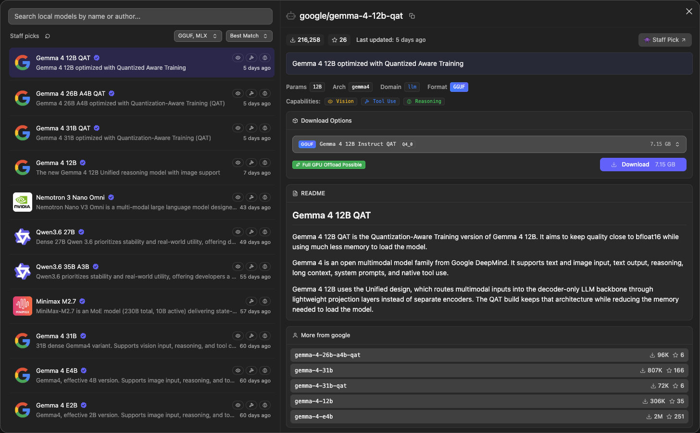
:::

**Download** — a built-in model catalog:

- Staff picks list the current good defaults; search covers the rest
- Each entry: params, quant, size, capability tags (this 12B at 4-bit: 7.15 GB)
- Green badge = "fits your RAM/VRAM" *before* you download

:::
::: {.column width="50%"}
::: {.center-content}
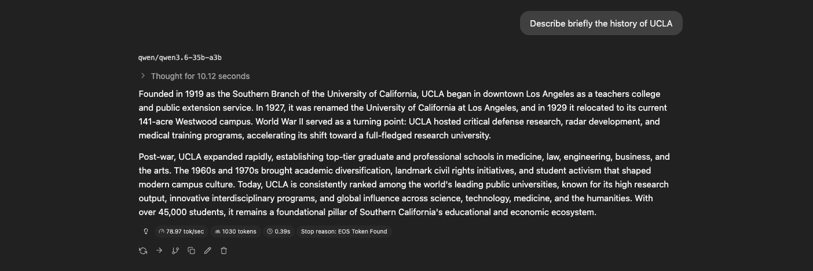
:::

**Chat** — load it and talk:

- Nothing leaves the machine; unplug the network and it still works
- ~79 tokens/sec on a Mac (the stats line is in the capture)
- Reasoning models show their thinking in an expandable "Thought for..." block
- Swap models per chat: the picker lists everything you've downloaded

:::
::::
:::

## The serve toggle: LM Studio becomes an endpoint, not just a chat app {.slide-code}

::: {.text-sm}
:::: {.columns}
::: {.column width="58%"}

::: {.center-content}

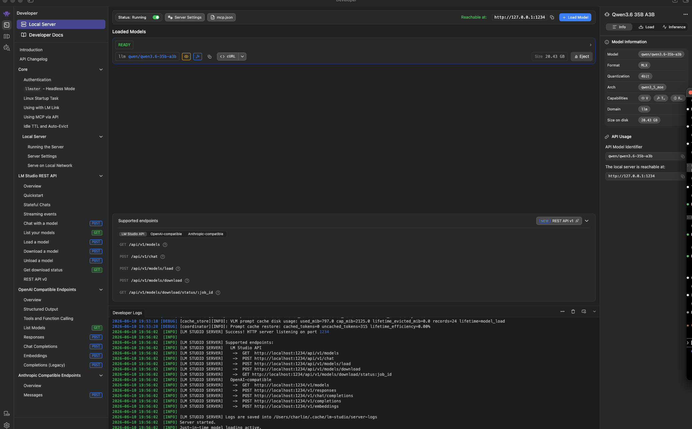
:::

:::
::: {.column width="42%"}

- One toggle and LM Studio is *hosting* the model: an HTTP server on `localhost:1234`, OpenAI-compatible
- Any AI app that can point at an external LLM endpoint can now use *your* local model: Open WebUI, editor plugins, agent CLIs, your own scripts
- LM Studio's own chat window is just one client of that endpoint

::: {.highlight-box}
Download once, serve from one machine, and every app you use gets a local model.
:::

:::
::::
:::

<!-- Demo 1: first-MCP on-ramp, REAL captured run (2026-06-11). Two official
     reference servers (filesystem scoped to one folder + sqlite) added to
     LM Studio's mcp.json, qwen3.6-27b. Folder: a deliberately messy
     ~/test/mytest/shared-drive with planted passwords.txt / .env / salary
     file and invoices as both .csv and .db. Assets: lmstudio-mcpjson-crop,
     lmstudio-mcp-toggles, lmstudio-fs-map-crop, lmstudio-fs-flags-crop,
     lmstudio-sqlite-revenue-crop. -->
## Demo 1 — your first MCP is a JSON file {.slide-code}

::: {.text-sm}

Most apps control how MCPs are installed and run with one `mcp.json` file. Here, two official reference servers: **filesystem** (read a folder) and **sqlite** (query a database). No accounts, no keys. In LM Studio: **Integrations → Install → Edit mcp.json**, paste, save.

:::: {.columns}
::: {.column width="55%"}

```{.json}
{
  "mcpServers": {
    "filesystem": {
      "command": "npx",
      "args": [
        "-y",
        "@modelcontextprotocol/server-filesystem",
        "/Users/charlie/test/mytest/shared-drive"
      ]
    },
    "sqlite": {
      "command": "uvx",
      "args": [
        "mcp-server-sqlite",
        "--db-path",
        "/Users/charlie/test/mytest/shared-drive/Finance/invoices.db"
      ]
    }
  }
}
```

::: {.text-xs}
Copy it; just replace the folder and database paths with yours.
:::

:::
::: {.column width="45%"}

::: {.center-content}
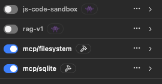
:::

- `npx` / `uvx` fetch and run the server; nothing to install by hand
- The filesystem server's **last argument is the only folder it can see**: least privilege, set in one line
- Saving reloads the servers; toggle each on in Integrations

:::
::::
:::

## Demo 1 — "what's here, and what shouldn't be?" {.slide-data}

::: {.text-sm}
Two questions, two tool calls. *"What's in here? Give me a map"* → `directory_tree`. *"Anything here that shouldn't be on a shared drive?"* → it flags `passwords.txt`, `.env`, the salary file, the tax returns.

<div style="text-align:center; line-height:0; margin:0.3em 0;">
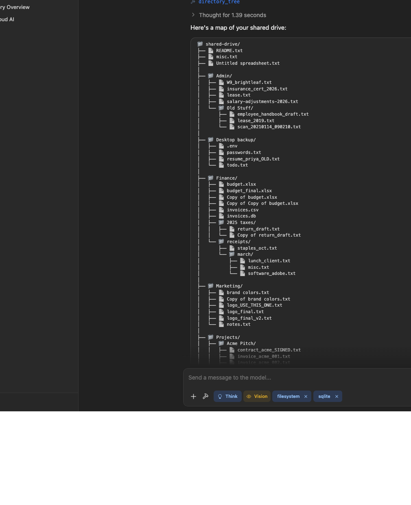
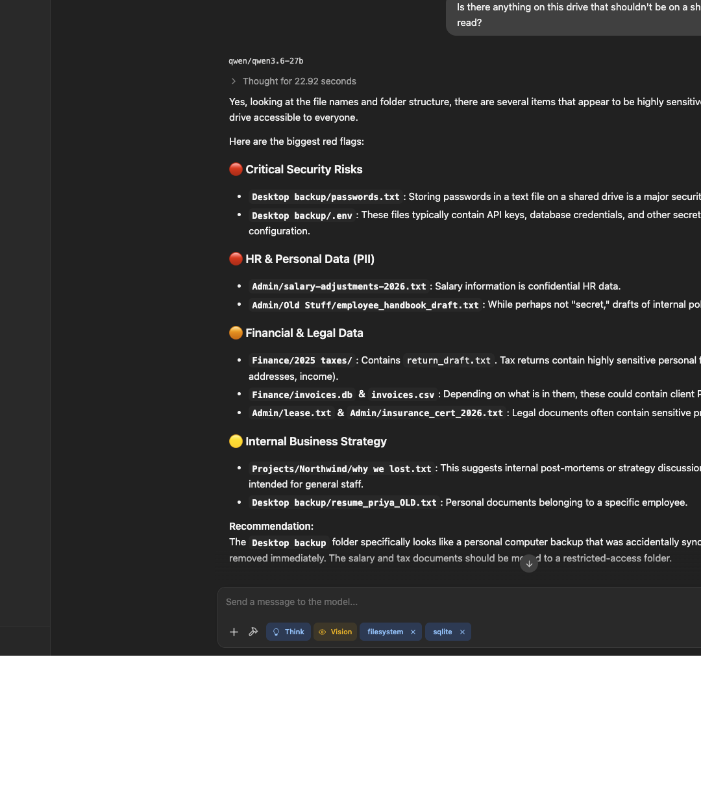
</div>

::: {.highlight-box}
A model just read a file named `passwords.txt` and reasoned about it, and nothing left the Mac. You'd never paste this drive into a cloud chatbot.
:::
:::

## Demo 1 — ask the data, not the model {.slide-data}

::: {.text-sm}
:::: {.columns}
::: {.column width="55%"}

::: {.center-content}
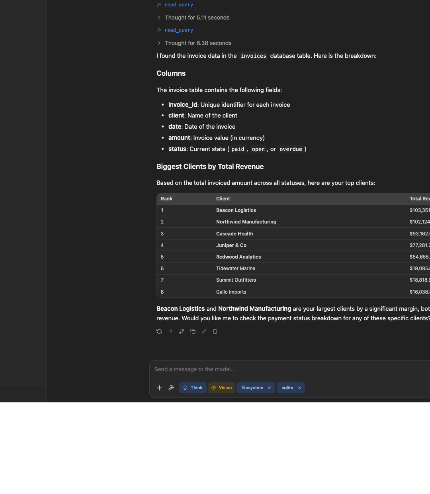
:::

:::
::: {.column width="45%"}

*"Find our invoice data. What columns does it have, and who are our biggest clients by revenue?"*

- **filesystem** finds `invoices.csv` and `invoices.db`; the model reports the columns
- **sqlite** runs the actual `GROUP BY` for the revenue ranking. Beacon ($103,351), Northwind ($102,125), Cascade ($93,162): computed, not guessed
- Two tiny off-the-shelf tools, no code

::: {.callout-tip appearance="simple"}
### The first-tool lesson
Pick an MCP that touches something you already have: your files, your database. The payoff is instant, and "install" was a paragraph of JSON.
:::
:::
::::
:::

<!-- Demo 2, three slides: REAL captured run (2026-06-10). Qwen3.6-27b in
     LM Studio + the edamcp MCP over 11M rows of NYC taxi data. Assets:
     lmstudio-eda-chat.png (tool cascade), edamcp-report.png (report top),
     docs/edamcp-nyctaxi-report.html (the actual 3.5 MB report, linked). -->
<!-- Demo 2 setup folded in: the EDA-chore framing and the with/without-MCP
     contrast now live in the intro line and bullets of the run slide. -->
## Demo 2 — the run: 11M taxi trips {.slide-data}

::: {.text-sm}
Every new dataset owes you hours of EDA: distributions, missingness, outliers, leakage checks. The MCP is that checklist preprogrammed: the EDA I would personally run, as deterministic code. The model orchestrates; the tools compute.

:::: {.columns}
::: {.column width="55%"}

::: {.r-stack}
::: {.fragment .fade-out fragment-index=0}
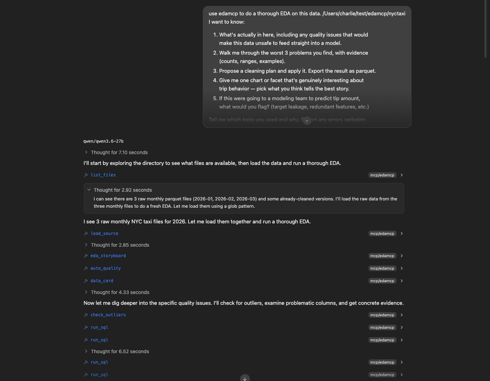
:::
::: {.fragment .fade-in-then-out fragment-index=0}
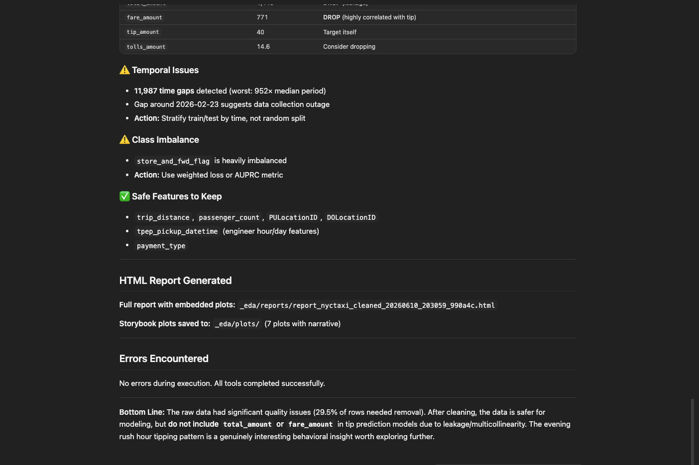
:::
::: {.fragment .fade-in fragment-index=1}
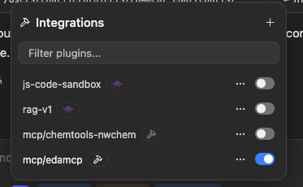
:::
:::

::: {.text-xs}
Arrow keys flip: the start of the run → the verdicts at the end → the whole setup (Integrations menu, `mcp/edamcp` toggled on).
:::

:::
::: {.column width="45%"}

- The brief: five numbered deliverables, evidence required, "report errors verbatim." How you task a worker, not "analyze this please"
- **Qwen3.6 27B, running locally in LM Studio.** The agent loop, live: think → pick a tool → read the result → pick the next
- 22 tool calls across 13 edamcp tools: `load_source`, `eda_storyboard`, `auto_quality`, `check_outliers`, `run_sql`...
- Without the MCP, a model improvises methods and does statistics "in its head"; with it, same numbers every run, tokens spent on findings instead of raw rows
- "Thick tool, thin agent" in practice. Setup was one Integrations toggle (last flip)
:::
::::
:::

## Demo 2 — the receipts {.slide-data}

::: {.text-sm}
:::: {.columns}
::: {.column width="50%"}

::: {.scroll-box .prose}

:::

::: {.text-xs}
The full chat, rendered: the prompt, the model's thinking, all 22 tool calls with raw results, and the findings. It scrolls.
:::

:::
::: {.column width="50%"}

::: {.r-stack}
::: {.fragment .fade-out fragment-index=0}
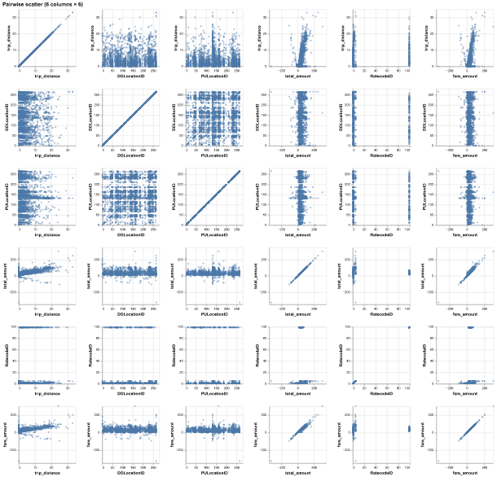
:::
::: {.fragment .fade-in-then-out fragment-index=0}
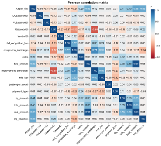
:::
::: {.fragment .fade-in fragment-index=1}
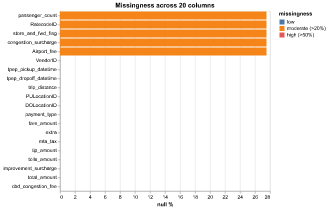
:::
:::

::: {.text-xs}
Three of the seven storyboard plots (arrow keys flip): pairwise scatter → correlation heatmap → missingness.
:::

**The deliverables are artifacts, not chat text:** a cleaned 154 MB parquet, 7 plots, and a 3.5 MB self-contained HTML report — [open the actual one from this run](edamcp-nyctaxi-report.html)

::: {.highlight-box}
The numbers are computed, not remembered: same data, same verdicts tomorrow.
:::
:::
::::
:::

# Control the Environment {background-color="#1C6D72"}

<!-- Hosting intro: where the engine runs (local vs remote GPU box). -->
## Hosting a model: it doesn't have to be your laptop {.slide-cluster}

::: {.text-md}
:::: {.columns}
::: {.column width="58%"}

An inference engine runs the model and exposes it as an API. *Where* it runs is your choice:

- **On your machine** — laptop or workstation, one user
- **On a bigger box** — a lab server, an HPC node, or a cloud VM with real GPUs, reached over the network

You stay on your laptop; the model lives with the GPUs; they talk over an (almost always OpenAI-compatible) HTTP API.

:::
::: {.column width="42%"}
::: {.highlight-box}
"Where you work" and "where the model runs" are separate choices. One shared GPU node can serve a whole lab.
:::

::: {.callout-note appearance="simple"}
### The two engines here
**Ollama** — easiest, single-user. **vLLM** — high-throughput, multi-user, HPC. (llama.cpp is the engine under Ollama and LM Studio.)
:::
:::
::::
:::

<!-- Size + quantization + the VRAM table (moved here from Section 2: this is
     where the hardware decision happens). Numbers are rule-of-thumb. -->
## Size and quantization: what fits on a GPU {.slide-compute}

::: {.text-sm}
:::: {.columns}
::: {.column width="42%"}

**Parameters = the model's size.** More parameters, more reasoning and knowledge. Rough feel: 7B is a capable assistant, 70B approaches frontier on many tasks, 600B+ is frontier-scale.

**Quantization = compression.** Lower numeric precision: smaller, faster, less VRAM, with a quality cost that grows as you squeeze:

- **8-bit** ≈ indistinguishable from FP16
- **4-bit** slight loss; the usual local sweet spot
- **2-bit** real degradation; a last resort to fit

Quantization hurts small models more than big ones.

::: {.callout-note appearance="simple"}
### Rule of thumb
VRAM ≈ params × bytes-per-weight + ~20% for context. FP16 = 2 bytes, 8-bit = 1, 4-bit = 0.5.
:::

:::
::: {.column width="58%"}

| Params | FP16 (full) | 8-bit | 4-bit | 2-bit |
|-------:|:-----------:|:-----:|:-----:|:-----:|
| 7B  | ~16 GB | ~8 GB  | ~5 GB  | ~3 GB  |
| 13B | ~28 GB | ~14 GB | ~8 GB  | ~5 GB  |
| 32B | ~70 GB | ~35 GB | ~20 GB | ~11 GB |
| 70B | ~150 GB | ~75 GB | ~40 GB | ~22 GB |
| 405B | ~810 GB | ~405 GB | ~230 GB | ~120 GB |

**What that buys:** a 24 GB GPU runs a 32B at 4-bit; a 70B at 4-bit wants 2×24 GB or one 48 GB card; a 192 GB Mac handles a 70B comfortably.

::: {.text-xs}
Rough numbers; longer context windows need more.
:::

:::
::::
:::

<!-- Companion to the size/quant slide: params buy reasoning, reasoning sets
     how explicit the prompt has to be. The manager metaphor scaled to worker
     ability; ties forward to thick/thin tool design. -->
## Model size sets the prompt you have to write {.slide-compute}

::: {.text-sm}
Parameters buy reasoning; reasoning fills the gaps your prompt leaves. The smaller the model, the more explicit the prompt:

:::: {.columns}
::: {.column width="33%"}
::: {.highlight-box}
**Frontier** (GPT-5.5, Opus)
:::

- Reasoning is the product: vague prompts still land; it plans the steps itself
- Task it like a **senior colleague**: intent + constraints. "Handle the archive cleanup, flag anything odd"
:::
::: {.column width="33%"}
::: {.highlight-box}
**Mid, ~30–120B** (Qwen 32B, Llama 70B)
:::

- "OK" reasoning: it won't fill in steps you didn't spell out. One task at a time, steps in order, success criteria stated
- Brief it like a **competent junior**: a complete work order, then it executes well
:::
::: {.column width="33%"}
::: {.highlight-box}
**Tiny, ≤13B**
:::

- Don't lean on reasoning; multi-step chains fall apart. Bounded tasks only: read a file, extract, list, basic summary
- Prompt like **walking a parent through computer support**: every step spelled out, nothing assumed
:::
::::

::: {.highlight-box}
**Judge a local model by its tool calling, not its trivia.** The tools do the work; the model picks the right tool and relays results. Size to the job, not the leaderboard.
:::
:::

<!-- Context length: the under-accounted-for cost. Ties back to the VRAM slide:
     context competes with weights for GPU memory. -->
## Context length: the budget everyone forgets

::: {.text-sm}
:::: {.columns}
::: {.column width="44%"}

**Context = how many tokens the model holds at once.** A token is about ¾ of a word, so 1,000 tokens ≈ 750 words. Your prompt, the replies, attached files, and the whole back-and-forth all count against it.

**Long chats fill it.** Near the limit, many apps quietly summarize older turns to make room; the model forgets details without telling you.

**Two limits, not one:**

- Every model has a *max* context it supports (8K, 32K, 128K, 1M)
- Context also costs VRAM: the KV cache grows with every token, *on top of* the weights. Fill the GPU with the model and there's no room left for context.

:::
::: {.column width="56%"}

| Context | ≈ Words | ≈ Pages | KV cache (~8B, FP16) |
|--------:|--------:|--------:|:--------------------:|
| 4K   | ~3,000   | ~6     | ~0.5 GB |
| 8K   | ~6,000   | ~12    | ~1 GB |
| 32K  | ~24,000  | ~48    | ~4 GB |
| 128K | ~96,000  | ~190   | ~16 GB |
| 1M   | ~750,000 | ~1,500 | ~128 GB |

**The trap:** a big model *plus* a big context can blow past your GPU even when the weights alone fit.

::: {.text-xs}
KV-cache numbers are rough and scale with model size: a 70B's cache is several times larger per token. Quantizing the KV cache (8-bit) roughly halves it.
:::

:::
::::
:::

<!-- Ollama 1 of 2: install, pull, run. -->
## Ollama: a model in one command {.slide-code}

::: {.text-sm}
:::: {.columns}
::: {.column width="50%"}

The simplest engine. The installer sets it up as a background service; built for laptops and single-user work.

::: {.scroll-box}
```bash
# install (macOS / Linux)
curl -fsSL https://ollama.com/install.sh | sh

# download a model from the registry
ollama pull qwen2.5:32b

# chat in the terminal (pulls if needed)
ollama run qwen2.5:32b

# what's downloaded / what's loaded now
ollama list
ollama ps
```
:::

:::
::: {.column width="50%"}

::: {.center-content}
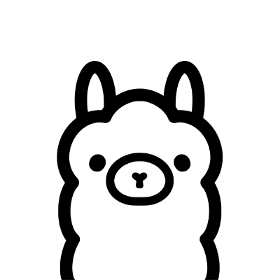
:::

- `pull` downloads the weights once; after that the model runs fully offline
- It runs *any* registry model **if the machine can hold it**: the weights *plus* the KV cache for your context (the two tables you just saw)
- Models swap in and out on demand; keep several pulled

:::
::::
:::

<!-- Ollama 2 of 2: the API endpoints (localhost + network) and the point
     that any AI app with a base-URL setting can use them. -->
## Ollama is an API: paste the URL into any AI app {.slide-code}

::: {.text-sm}
:::: {.columns}
::: {.column width="50%"}

While the service runs, it serves an OpenAI-compatible API:

::: {.scroll-box}
```bash
# on your own machine, it's already serving:
#   http://localhost:11434

# share the GPU box with your network:
OLLAMA_HOST=0.0.0.0:11434 ollama serve
# others then point at:
#   http://gpu-box.mylab.edu:11434

# quick check it's alive
curl http://localhost:11434/v1/models
```
:::

- One shared box can serve a whole lab; clients only need the URL

::: {.highlight-box}
**This is the bare LLM: text in → text out.** The tools and the agentic loop live in the *app*; Ollama is just its backend.
:::

:::
::: {.column width="50%"}

Most AI apps have a setting called **base URL** (or "OpenAI-compatible endpoint"). Paste the Ollama URL there and that app now runs on *your* model: Open WebUI, LibreChat, Claude Code, Crush, editor plugins, your own scripts.

::: {.accent-box}
**Opening the port = publishing the model.** Ollama ships with no auth: keep it on a private network or VPN, or front it with a token (reverse proxy, SSH tunnel). Never expose `11434` to the public internet.
:::

:::
::::
:::

<!-- vLLM: dense reference — throughput serving, multi-GPU, HPC. -->
## vLLM: throughput serving for shared GPUs {.slide-cluster}

::: {.text-sm}
:::: {.columns}
::: {.column width="50%"}

Production-grade serving: high throughput, continuous batching, many concurrent users, tensor-parallel across GPUs. The choice for an HPC node or shared lab server.

::: {.scroll-box}
```bash
pip install vllm

# OpenAI-compatible server on port 8000.
# tensor-parallel-size splits the model across GPUs.
vllm serve Qwen/Qwen2.5-32B-Instruct \
  --tensor-parallel-size 2 \
  --max-model-len 32768

# On an HPC node: launch inside your Slurm/SGE job,
# then point clients at the node's hostname.
```
:::

:::
::: {.column width="50%"}

Same OpenAI-compatible API as Ollama, different base URL (`http://gpu-node:8000/v1`). Start on Ollama, graduate to vLLM; the apps don't change.

::: {.callout-note appearance="simple"}
### Ollama vs vLLM
Ollama: easiest, one user, laptop-friendly. vLLM: max throughput, many users, needs real GPUs.
:::

:::
::::
:::

# Control by Configuration {background-color="#1C6D72"}

<!-- Moved from Environment + expanded for agent apps and model choice. Bridges
     from "you ran a model" into "now point your apps at it." -->
## Point any app at the model you choose {.slide-flow}

::: {.text-md}
:::: {.columns}
::: {.column width="58%"}

You ran a model in the last section. Now aim your apps at it. For most apps it's a setting, not code:

- **Chat UIs** (Open WebUI, LibreChat) → cloud API *or* your local endpoint
- **Desktop agents** (Claude Code, openwork) → pick a local or chosen model
- **CLI agents** (Claude Code, Codex, OpenCode) → set the base URL and model
- **Office / editor plugins** → same idea

Pick per task: a local model for private or cheap work, a frontier model for the hard parts.

:::
::: {.column width="42%"}
::: {.highlight-box}
You're not stuck with whatever model an app ships with. The app and the model are separate choices, and you make both.
:::

::: {.callout-note appearance="simple"}
### No code in this section
Everything here is UI configuration: upload files, set a system prompt, pick a model from a menu. The landing spot for the half of the room that doesn't code; the data never leaves wherever you point it.
:::
:::
::::
:::

<!-- Open WebUI tour: synced 5-screen reveal, same r-stack pattern as the
     desktop-agent and CLI slides. Real captures from my home server. -->
## Open WebUI: a chat UI you host yourself {.slide-flow}

::: {.text-sm}

ChatGPT's interface, served from your own box: install with pip or Docker, leave it running, the lab connects in a browser. It runs no models itself; you point it at Ollama, vLLM, or a cloud key. (Arrow through five screens.)

:::: {.columns}
::: {.column width="55%"}
::: {.r-stack}
::: {.fragment .fade-out fragment-index=0}
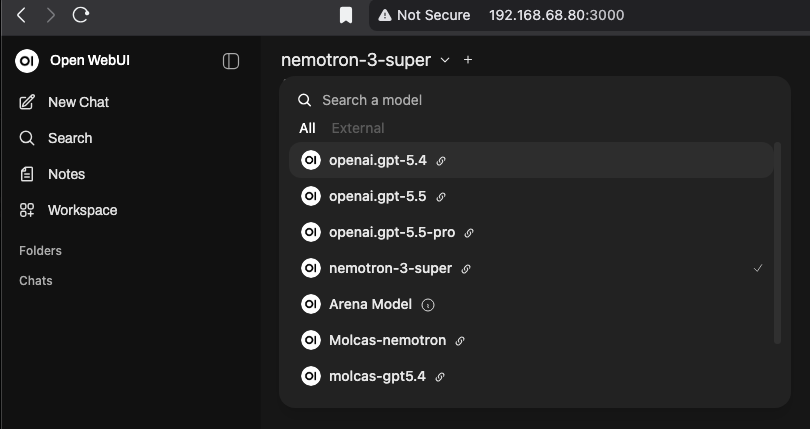
:::
::: {.fragment .fade-in-then-out fragment-index=0}
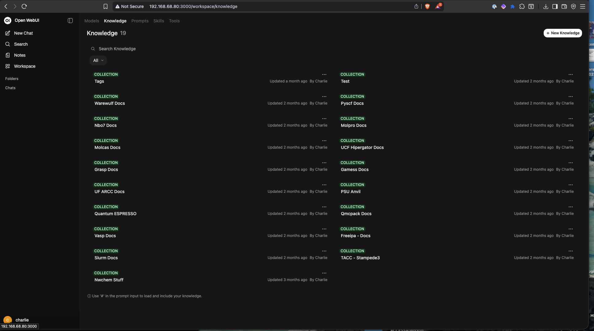
:::
::: {.fragment .fade-in-then-out fragment-index=1}
<div>
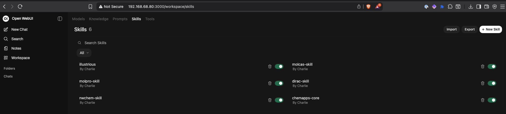
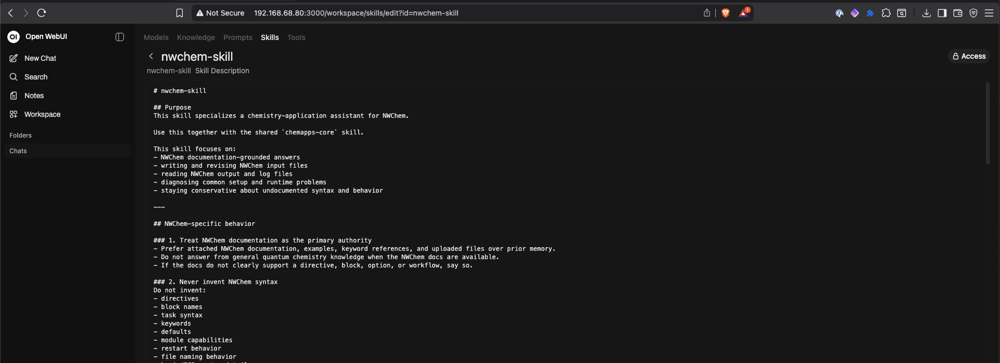
</div>
:::
::: {.fragment .fade-in-then-out fragment-index=2}
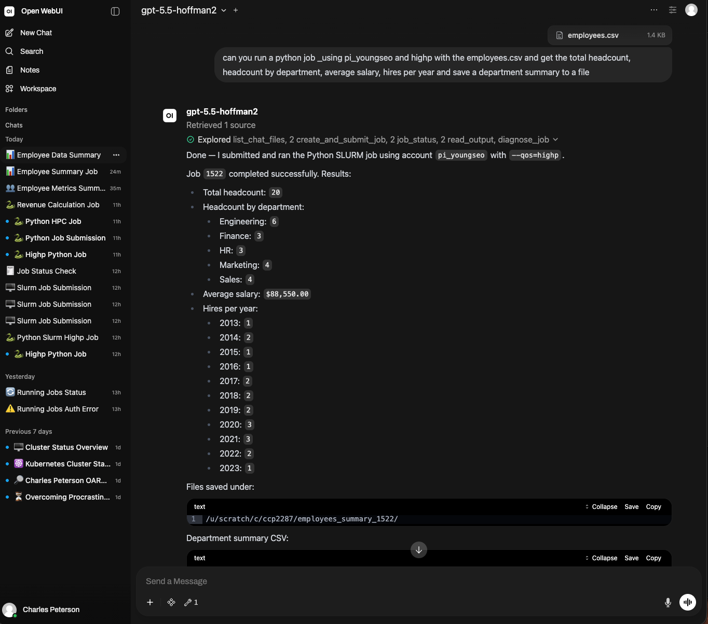
:::
::: {.fragment .fade-in fragment-index=3}
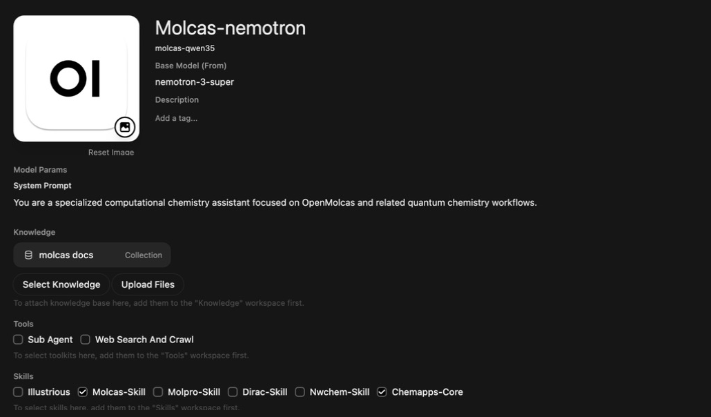
:::
:::
:::
::: {.column width="45%"}
::: {.r-stack}
::: {.fragment .fade-out fragment-index=0}
#### One UI, any model

- The model picker mixes cloud GPT-5.5 with a local Nemotron served down the hall; switch per chat
- Chat-first, like ChatGPT: not agentic by default, but tools and skills (coming up) extend it
- [Docs →](https://docs.openwebui.com)
:::
::: {.fragment .fade-in-then-out fragment-index=0}
#### Knowledge Bases

- Upload PDFs, docs, manuals; the app indexes them and answers cite *your* documents
- Mine: one collection per chemistry code and per cluster (Slurm, Stampede3, Anvil...)
- Next slide shows what this buys
:::
::: {.fragment .fade-in-then-out fragment-index=1}
#### Skills

- Markdown instructions for *how* to do a task, uploaded once and toggled on
- This one pins NWChem answers to the uploaded docs and forbids invented syntax
:::
::: {.fragment .fade-in-then-out fragment-index=2}
#### Tools

- Small Python functions created in the UI; the model calls them mid-chat
- Here: upload a CSV in the browser, and a Hoffman2 tool submits a real SLURM job and reports back
:::
::: {.fragment .fade-in fragment-index=3}
#### Custom models

- One saved name = base LLM + system prompt + KBs + tools + skills
- No training involved, just configuration: "Molcas-Nemotron" is a local Nemotron wearing the Molcas docs and skill
:::
:::
:::
::::
:::

<!-- Sketch 32 -->
## Knowledge Bases

::: {.text-md}
:::: {.columns}
::: {.column width="55%"}

- I upload PDFs, docs, or text. The app indexes them.
- I ask a question. The app pulls the relevant passages and hands them to the model with my question.
- The model answers grounded in *my* documents, not its training data.

**My KBs:**

- **Software docs** — ask about syntax, it cites the actual docs instead of a function signature from three versions ago
- **Chemistry textbooks** — attached to a chemistry model; it cites real content instead of a plausible-sounding guess

:::
::: {.column width="45%"}

<!-- Real capture (2026-06-12): Molcas-nemotron + "molcas docs" collection in
     Open WebUI, answering the grid-default question from the manual. -->
::: {.center-content}
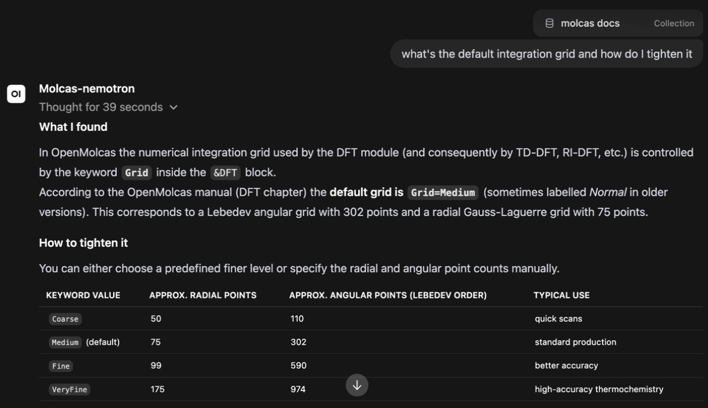
:::

::: {.text-xs}
Live capture: the *molcas docs* collection is pinned to the question; the default and the tightening table come from the manual, not memory.
:::
:::
::::
:::

<!-- Sketch 33 + 34 merged: everyone's example, with the RAG reveal and its
     limit folded into the closing box. Hands off to Control the Behavior. -->
## Search your pile of stuff: everyone's example {.slide-data}

::: {.text-md}
Everyone has a pile of unstructured text they sometimes need to search. Drag 200 files into a KB. Ask a question. Get an answer that cites the file and section.
:::

::: {.text-sm}
:::: {.columns}
::: {.column width="50%"}

- **HR** — years of policy docs and correspondence
- **Admin** — email archives, meeting notes
- **Research consultants** — past consultation write-ups
- **Sysadmins** — runbooks, incident reports
- **Mobile support** — ticket histories
- **Researchers** — the PDFs you meant to read

:::
::: {.column width="50%"}

- "When did we last discuss the budget review process?" → answer + file
- "Which past consultations involved GPU sizing for ML?" → list with references
- "Has any ticket described this error before?" → matches with context

::: {.highlight-box}
The citation *is* the trust mechanism: you can verify every answer.
:::
:::
::::

::: {.highlight-box}
**That was RAG** (Retrieval-Augmented Generation): upload, retrieve, cite. You already have it in LM Studio, Open WebUI, AnythingLLM, NotebookLM. Its limit: a KB gives the model *facts*, not *procedure*. Procedure is tools and skills, the next section.
:::
:::


# Control the Behavior {background-color="#1C6D72"}


<!-- Sketch 41 + 42 merged: commodity scaffolding + the pattern for every
     example. Callback to the .exe just shown. -->
## Don't reinvent the scaffolding {.slide-flow}

::: {.text-md}
:::: {.columns}
::: {.column width="58%"}

What I *haven't* built: a chatbot app, an agent framework, a conversation UI. All solved, free, maintained by large teams:

- **Agent apps** — Claude Code, Codex, OpenCode
- **Chat UIs** — Open WebUI, LibreChat
- **Local serving** — LM Studio, Ollama

Every example below: an off-the-shelf agent app plus a tool I wrote. The cool part is the tool; the app is interchangeable. (Compliance worry? The open-source options cover it.)

:::
::: {.column width="42%"}
::: {.highlight-box}
Your leverage is in the tools and skills that encode your expertise, not in the scaffolding. Nobody else will build your tool, because nobody else runs *your* cluster.
:::

::: {.callout-note appearance="simple"}
### Watch the shape
The only thing that changes between examples is what the tool knows.
:::
:::
::::
:::

<!-- Example 1, one slide: the NWChem MCP described in the lead, then the
     REAL captured A/B/C experiment (2026-06-10). Job: acetate anion,
     B3LYP/aug-cc-pVDZ, `grid xcoarse`. Converges cleanly, normal-looking
     energy, but the grid is too coarse: integrated density 32.0043 vs 32
     electrons, energy off ~5 kcal/mol vs `grid fine`. Raw output 113 KB
     ≈ 28k tokens. Same prompt to all three readers. -->
## Example 1 — the NWChem MCP, put to the test {.slide-data}

::: {.text-sm}

- **Problem:** an NWChem output (a chemistry calculation) runs to hundreds of lines; reading it all takes time. A frontier model can read it for you, but then the *AI* decides what to look for, and burns tokens doing it
- **Solution:** an MCP that follows every step *I* would take analyzing an NWChem output myself, encoded once
- **The test:** a job that **converges cleanly** with a normal-looking energy, but `grid xcoarse`: ∫ρ = 32.0043 vs exactly 32 electrons, worth ~5 kcal/mol. Same prompt to each reader: *"can you see if my nwchem job looks good acetate_grid.out"* (113 KB ≈ 28k tokens)

| Reader | Caught the bad grid? | Tokens to answer | How it got there |
|---|---|---|---|
| **Claude Opus 4.8** (frontier), no tools | Yes, but called it ~1 kcal/mol; a second casual run dismissed the same number as "fine" | ~28k | Read the raw file in several greps; applied a threshold from its own training |
| **Nemotron 3 Super** (local), no tools | **No** | ~12.5k | Printed ∫ρ = 32.004 and said "very close to 32, looks good" |
| **Nemotron 3 Super + chemtools MCP** | **Yes**, same flag every run, with the fix | **~0.7k** | The digest arrived with `grid_quality` already flagged; the model relayed it |

::: {.highlight-box}
Same small model, same prompt, the only change is the MCP. A miss became a catch, so the credit belongs to the tool.
:::
:::

## Why the tool won: it ships the threshold, not the file {.slide-data}

::: {.text-sm}

:::: {.stat-row}
::: {.stat-card}
**~40×**
input reduction
(0.7k vs 28k tokens)
:::
::: {.stat-card}
**~44 s**
end to end,
2 tool calls
:::
::: {.stat-card}
**~5 kcal/mol**
the error a "converged"
job was hiding
:::
::::

- **The miss wasn't a reading failure.** The local model *printed* 32.004 and still said "looks good": it lacked the threshold. The MCP ships the threshold; the model only relays it.
- **Frontier alone wasn't reliable either.** Opus caught it once, waved off the same number once, lowballed it both times. A deterministic digest beats frontier variance on judgments with a right answer.
- **The digest stays small as outputs grow.** This file: 113 KB. Opt/freq outputs: megabytes. The digest: roughly constant.
- **The real payoff is scale.** Nobody spots this on file 73 of 400. A small local model plus this MCP triages all 400.

::: {.highlight-box}
The thick-tool slide, with receipts: a small local model matched a frontier model at ~1/40th the tokens, because the thinking was already in the tool.
:::
:::

<!-- Example 2, REAL captured run (2026-06-11): Goose desktop agent +
     meetingtool MCP + Nemotron 3 Super (120B A12B) rented from NVIDIA's
     hosted endpoint. Three synthetic animal-shelter weekly meetings
     (week1-3.wav) + adoptable-pets-oct13.csv in ~/test/test. Transcription
     (WhisperX) + diarization ran locally; transcripts + summary written to
     meeting_transcripts_and_summary.txt. Hero: "where was Mittens
     mentioned" answered with Week-3 timestamps. Session JSON:
     "Meeting Summary Pet Data.json". -->
## Example 2 — three meetings, interrogated {.slide-data}

::: {.text-sm}

Three shelter meetings as audio, plus a CSV of adoptable animals. The brief to Goose: transcribe all three (meetingtool), fold in the CSV, write a summary file. New stack: desktop agent, NVIDIA-hosted open-weight Nemotron, transcription and diarization local. (Flip: the polling loop → the summary.)

::: {.r-stack}
::: {.fragment .fade-out fragment-index=0}
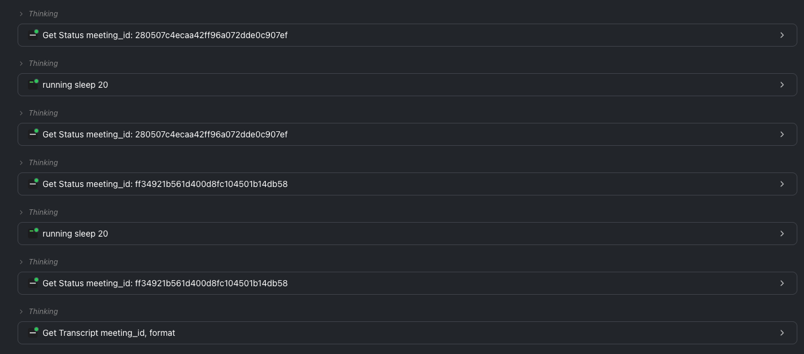
:::
::: {.fragment .fade-in fragment-index=0}
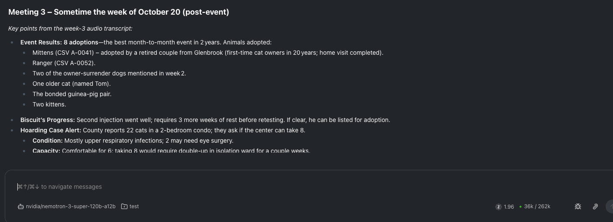
:::
:::
:::

## Example 2 — "where was Mittens mentioned?" {.slide-data}

::: {.text-sm}

::: {.center-content}
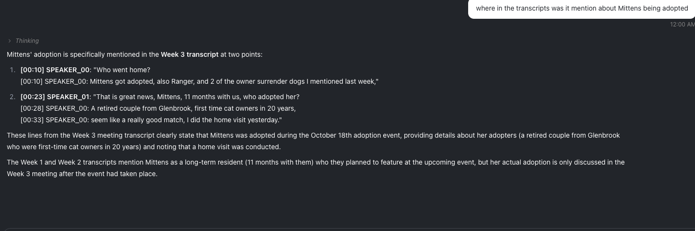
:::

:::: {.columns}
::: {.column width="58%"}

- The answer quotes the Week 3 tape at **[00:10]** and **[00:23]**, with speakers; Weeks 1–2 only *planned* to feature her. The timestamp is the citation
- **The same shape at scale:** hundreds of interview recordings plus CVs, "which candidates mentioned web-design experience?" → the relevant clips
- The audio never left the Mac; only transcript text went to the model

:::
::: {.column width="42%"}
::: {.highlight-box}
The AI doesn't pick the candidate or approve the adoption. It finds the moment in the tape so a human can judge it. AI doesn't replace the work; it makes the work faster.
:::
:::
::::
:::

## Generic AI gives generic answers.

::: {.text-md}
:::: {.columns}
::: {.column width="58%"}

1. Generic AI is often *worse* than no AI for environment-specific questions: it confidently points users down wrong paths
2. The fix isn't smarter AI. It's AI that knows your setup
3. Encode "how things actually work here" into a tool → a tier-0 support layer with *correct* answers. This is where sysadmins and consultants add enormous value
4. It stops the "AI is wrong" spiral: one bad answer, and someone resists AI for everything

:::
::: {.column width="42%"}
::: {.highlight-box}
You hold the knowledge that makes AI useful here. Encoding it into tools isn't a threat to your role. It's a force multiplier for it.
:::
:::
::::
:::

<!-- Example 4: office MCP via OpenCode (CLI) + LM Studio endpoint. REAL
     captured run (2026-06-10): test_memo.docx with planted defects (HTML
     entity, unbolded deadline, slop paragraph, typo). Assets:
     office-memo-before/after.png, office-sidebyside-midrun.png (hero),
     office-opencode-trace.png (full trace). Backup of the bad memo:
     ~/Downloads/test_memo.backup.docx for re-runs. -->
## Example 3 — Word doc tool {.slide-code}

::: {.text-sm}

The brief to OpenCode, in a terminal: fix the broken `&#x2014;` entity, bold the deadline, rewrite the corporate-filler closing with `human-writer`, fix typos. Model: a 30B local Qwen via LM Studio. Result: 311 → 222 words; the 48-word "synergistic alignment" closing became two sentences.

:::: {.columns}
::: {.column width="50%"}
::: {.accent-box}
**Before**
:::
::: {.center-content}
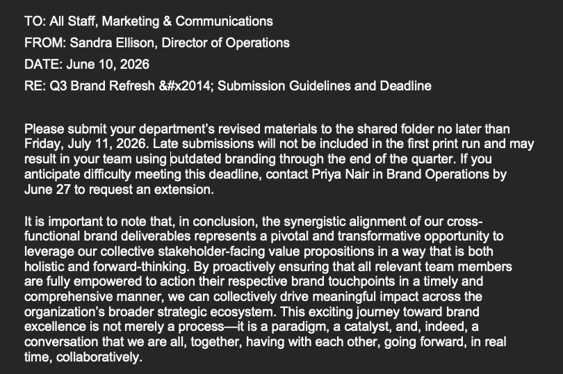
:::
:::
::: {.column width="50%"}
::: {.highlight-box}
**After**
:::
::: {.center-content}
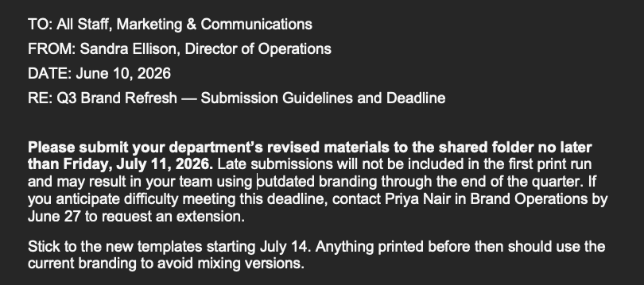
:::
:::
::::
:::

## Example 3 — the run, live {.slide-code}

::: {.text-sm}
:::: {.columns}
::: {.column width="62%"}

::: {.r-stack}
::: {.fragment .fade-out fragment-index=0}
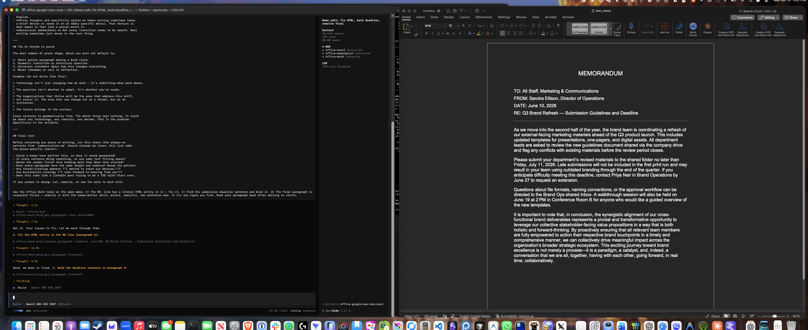
:::
::: {.fragment .fade-in fragment-index=0}
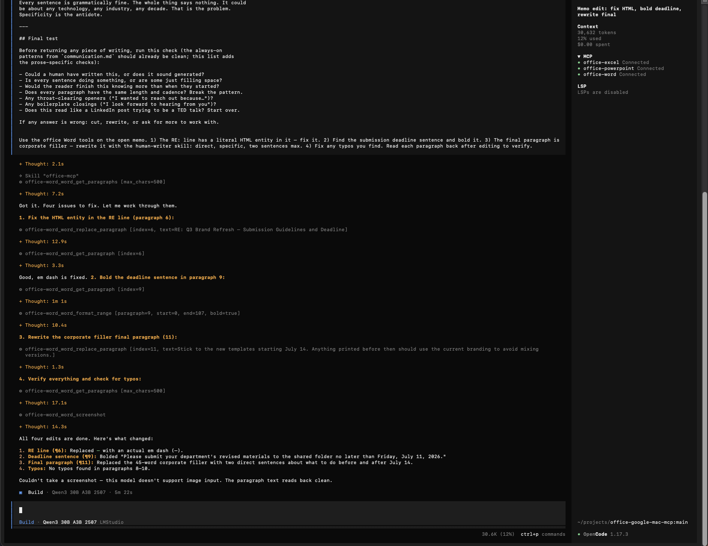
:::
:::

::: {.text-xs}
Mid-run (arrow flips to the full trace): fix #1 announced, `word_replace_paragraph` called, and the RE: line already has its em dash.
:::

:::
::: {.column width="38%"}

- **Read → edit → verify.** It reads the paragraph, edits it, then reads it back before moving on. The MCP is built around that loop; the model just follows it
- The edits land in the *open document*, live. Not a copy, not a diff to apply later
- It even took a screenshot to check its work, then noted this model can't see images and verified by reading the text back instead

::: {.highlight-box}
Every piece of this talk in one run: an app I didn't write (OpenCode), a model I host (LM Studio's endpoint), and a tool and a skill I did write (office MCP + human-writer).
:::
:::
::::
:::

<!-- Example 4 continued: Excel, REAL captured runs (2026-06-10). Same office
     MCP, four-task work order on company_data_q2_2026.xlsx (planted: gap
     column needed, misaligned floating block on Expenses, duplicate-name trap
     on Team Directory, dates stored as text). Run 1: Nemotron 3 Super via
     local vLLM + OpenCode — stuck on task 1 for ~10 min (formula refs after
     the column insert), wrote "test" into A1 to debug itself; captured as
     excel-nemotron-struggle.png and used as the control. Run 2: Claude Code +
     Opus — all four tasks, live SUMIF/DATEVALUE formulas, amber-flagged the
     two distinct Priya Nairs with a footnote, reported side effects.
     Workbook backups: company_data_q2_2026.{backup,pristine}.xlsx. -->
## Example 3 continued — the Excel tool {.slide-data}

::: {.text-sm}

Same office MCP, bigger ask, four sheets: a computed "Gap to Target" column with misses in red; a category summary table; a misaligned block to fix; a duplicate-name trap plus tenure from hire dates. Agent: Claude Code with a frontier model, on *thin* tools (read range, set cell, set formula).

::: {.r-stack}
::: {.fragment .fade-out fragment-index=0}
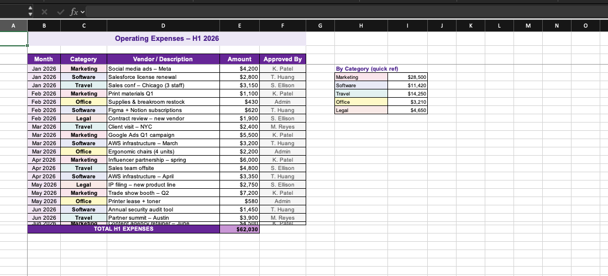
:::
::: {.fragment .fade-in-then-out fragment-index=0}
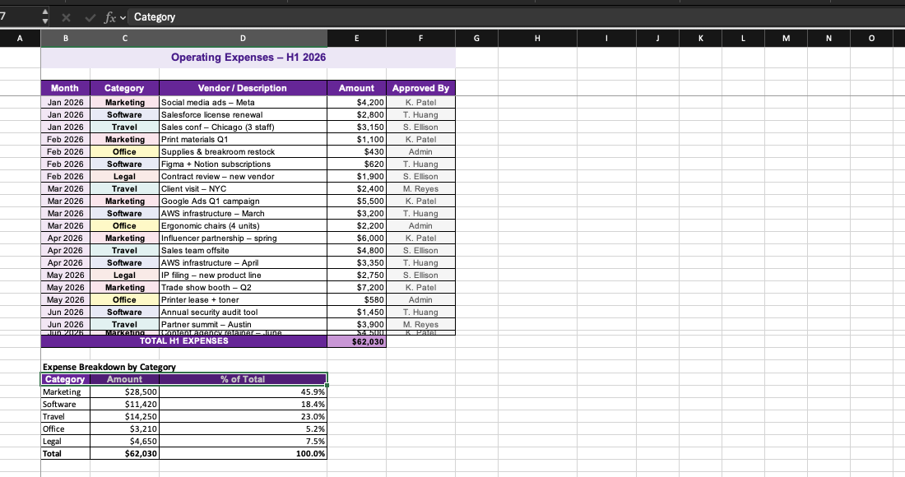
:::
::: {.fragment .fade-in-then-out fragment-index=1}
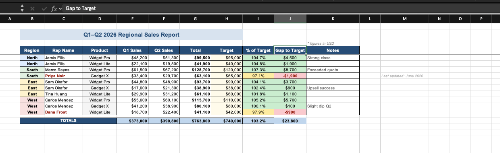
:::
::: {.fragment .fade-in fragment-index=2}
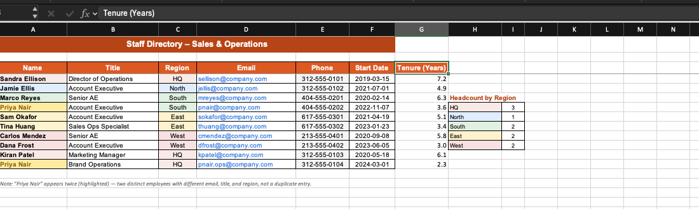
:::
:::

::: {.text-xs}
Arrow keys flip: Expenses before (the floating block in column H) → Expenses rebuilt with % of Total → Sales with the gap column and red flags → Team Directory with tenure and the amber-flagged name collision.
:::
:::

## Example 3 continued {.slide-data}

::: {.text-sm}
:::: {.columns}
::: {.column width="60%"}

::: {.r-stack}
::: {.fragment .fade-out fragment-index=0}
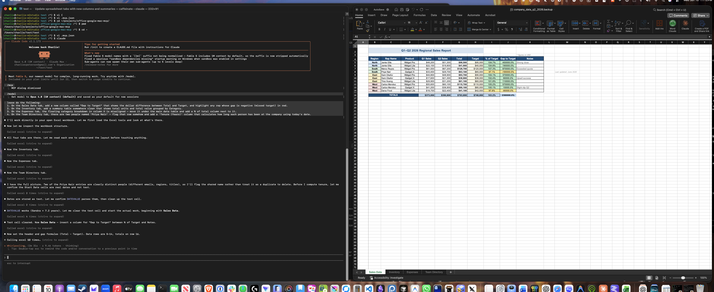
:::
::: {.fragment .fade-in-then-out fragment-index=0}
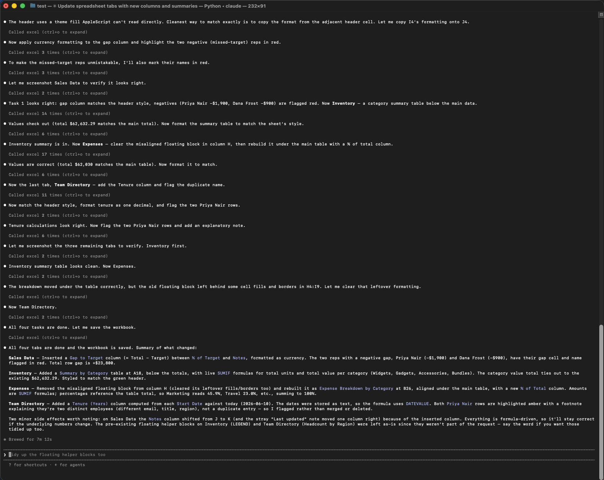
:::
::: {.fragment .fade-in fragment-index=1}
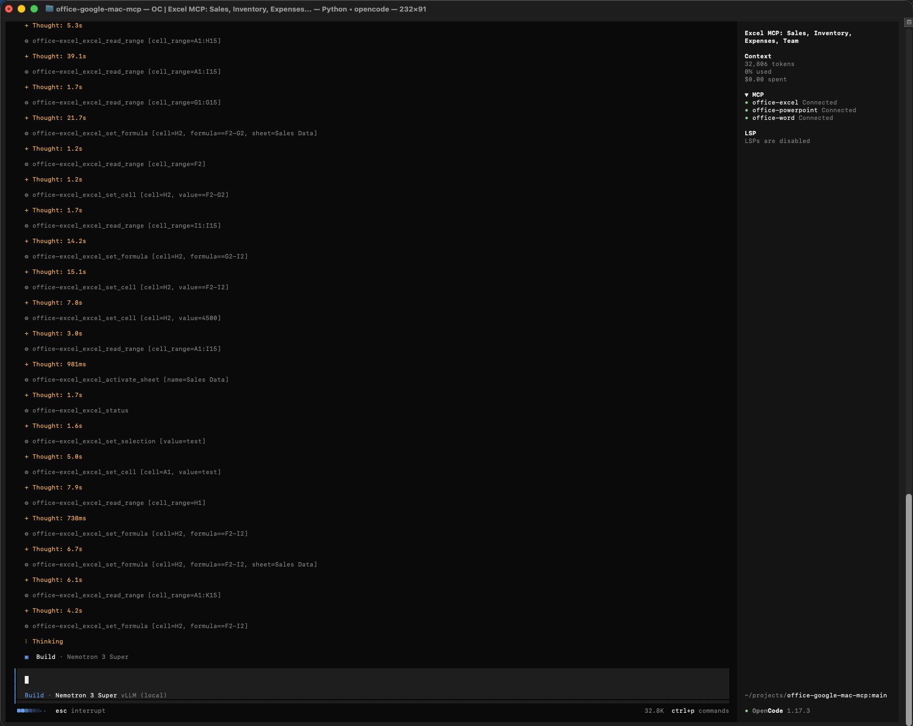
:::
:::

:::
::: {.column width="40%"}

- **It noticed what the prompt didn't say.** Two Priya Nairs, different emails/regions/titles → amber-flagged both with a footnote instead of deleting one. Dates stored as text → tested `DATEVALUE` in a scratch cell first
- **Live formulas, checked totals.** SUMIF tables that tie out to the sheet's own totals
- **Reported back like a worker:** per-tab summary plus "two minor side effects worth noting"

::: {.highlight-box}
**The last flip is the control run:** same MCP, same prompt, a mid-size local model — stuck on task 1, writing "test" into A1 to debug itself. Thin tools put the intelligence in the model; frontier carries it, mid-size drowns.
:::
:::
::::
:::

<!-- How this deck was made: real Positron window capture (2026-06-11).
     Skim live (~30 s): one arrow press pops the four labels. The labels are
     .shot-label chips positioned in percent coords over the screenshot. -->
## How this deck was made: AI as co-editor {.slide-code}

::: {.text-sm}
This deck, included: the context written once, then one targeted ask at a time, rendered live. Co-editor, not author.

::: {.center-content}
::: {.annotated-shot}
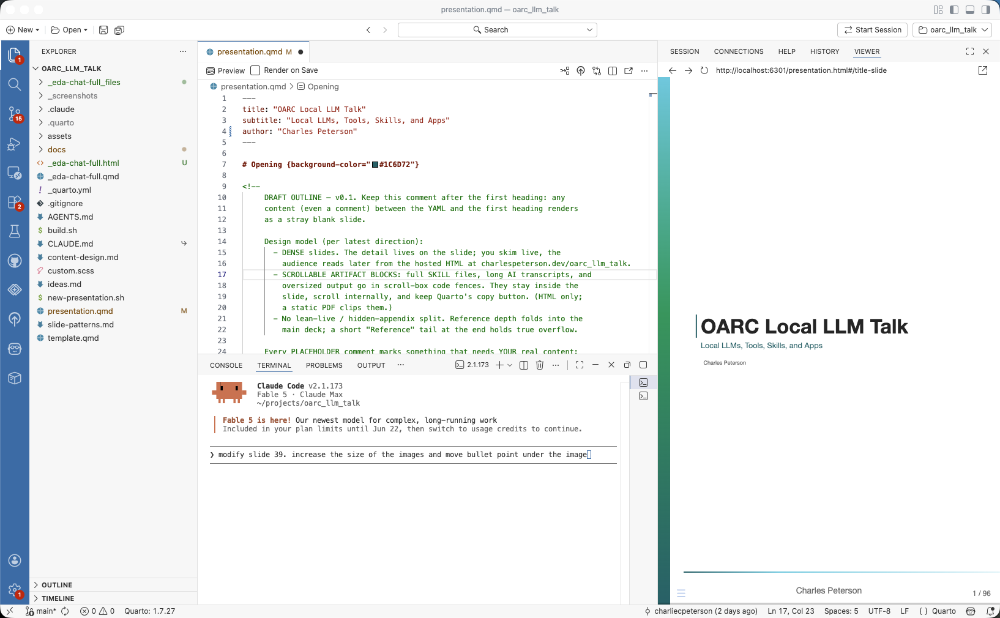

::: {.fragment}
[**Context, written once** — AGENTS.md, slide-patterns.md, content-design.md, custom.scss]{.shot-label style="left:1%; top:56%;"}
[**The deck is markdown** — presentation.qmd, just a text file]{.shot-label style="left:23%; top:13%;"}
[**The agent** — Claude Code in the editor's terminal: one targeted ask, not "make me a talk"]{.shot-label style="left:24%; top:74%;"}
[**Live preview** — every edit renders where I can judge it]{.shot-label style="left:67%; top:62%;"}
:::
:::
:::
:::

# The Real Insight {background-color="#1C6D72"}

<!-- Sketch 56 + the two-builders illustration, merged. -->
## Use AI where you're already strong

::: {.text-md}
:::: {.columns}
::: {.column width="50%"}

**AI amplifies what you bring.**

- Bring expertise → it amplifies expertise
- Bring nothing → it amplifies your mistakes, and you can't tell when it's off

The gut check before delegating: **can I tell a good output from a bad one?**

- Yes → go; you'll catch the mistakes
- No → step back, or learn enough to judge it first

:::
::: {.column width="50%"}

**"Build me a gaming website," two builders:**

::: {.accent-box}
**Non-developer** → a site that *looks* done. No auth, no real database, no payments. A demo, not a product.
:::

::: {.highlight-box}
**Web developer** → asks for auth, a hosted DB, billing, validation. Same AI; the prompt carries the foresight. The expert's edge is knowing what to ask for.
:::

That foresight is the difference between a **production product** and **vaporware**.

:::
::::

::: {.highlight-box}
**Not a "stay in your lane" rule.** Outside your expertise, slow down: learn as you go, and interact with the AI more through planning and discussion before delegating the doing.
:::
:::

<!-- Sketch 57-59 merged: keep the workflow, notice the autopilot work. -->
## Don't change your workflow for AI

::: {.text-md}
:::: {.columns}
::: {.column width="58%"}

Goals, outputs, standards: unchanged. What changes: how fast specific steps happen.

- **The common failure:** reshape the workflow around AI → new workflow is worse → drop AI, stay skeptical
- **The AI-ripe parts are the ones you've stopped seeing:** the 20-minute Tuesday task, the formatting step, the reply you've sent fifty times

:::
::: {.column width="42%"}
::: {.accent-box}
**AI adapts to you, not the other way around.** Stop the reshape. Insert AI into what already works.
:::

::: {.highlight-box}
Learning to see your own autopilot work is the real skill. Attention, not creativity.
:::
:::
::::
:::

# Summary {background-color="#1C6D72"}

<!-- Landing: takeaways + first-week on-ramp on one slide, the bet underneath. -->
## Summing things up {.slide-flow}

::: {.text-sm}
:::: {.columns}
::: {.column width="55%"}

**The whole talk:**

1. "AI" is a **model** plus everything wrapped around it. The wrapping (context, tools, skills) is the part you control, and what makes it yours.
2. Model and app are separate choices. "Local" means you control the data flow, not that it runs on a laptop.
3. **Tools** and **skills** move the thinking from runtime to design time. That's why a small local model is enough on your own turf.
4. AI amplifies what you bring. Use it where you can judge the output, and stay the manager.

:::
::: {.column width="45%"}

**What to try out:**

::: {.steps}
1. **Install LM Studio**, download a model the catalog says fits your machine
2. **Chat with it.** Learn what it handles well and where it gets lost
3. **Drag in a folder of documents**, ask questions, try different model sizes
4. **Write one skill, find one tool** for a simple, repetitive task you actually do
:::
:::
::::

::: {.highlight-box}
The bet of this talk: a small local model with your context, tools, and skills beats a frontier model flying blind, on the work that's specific to you. Lead AI. Don't follow it.
:::
:::

<!-- Summary apps: every app from the talk in one checkmark matrix.
     Rows ordered chat → agents → engines so the categories read top-down. -->
## Every app from this talk, one table {.slide-data}

::: {.text-xs .table-compact}

| App | Chat UI | Agent loop | Desktop GUI | CLI | IDE | Hosts models |
|-----|:-------:|:----------:|:-----------:|:---:|:---:|:------------:|
| [ChatGPT](https://chatgpt.com) | [✓]{.pill-yes} | | [✓]{.pill-yes} | | | |
| [Open WebUI](https://github.com/open-webui/open-webui) | [✓]{.pill-yes} | | | | | |
| [LibreChat](https://librechat.ai) | [✓]{.pill-yes} | | | | | |
| [AnythingLLM](https://anythingllm.com) | [✓]{.pill-yes} | | [✓]{.pill-yes} | | | |
| [Claude Code](https://claude.com/claude-code) | | [✓]{.pill-yes} | [✓]{.pill-yes} (desktop version) | [✓]{.pill-yes} (CLI version) | | |
| [Codex](https://openai.com/codex) | | [✓]{.pill-yes} | [✓]{.pill-yes} (desktop version) | [✓]{.pill-yes} (CLI version) | | |
| [Goose](https://goose-docs.ai) | | [✓]{.pill-yes} | [✓]{.pill-yes} | [✓]{.pill-yes} | | |
| [openwork](https://github.com/different-ai/openwork) | | [✓]{.pill-yes} | [✓]{.pill-yes} | | | |
| [OpenCode](https://opencode.ai) | | [✓]{.pill-yes} | | [✓]{.pill-yes} | | |
| [Copilot CLI](https://github.com/features/copilot/cli) | | [✓]{.pill-yes} | | [✓]{.pill-yes} | | |
| [Crush](https://github.com/charmbracelet/crush) | | [✓]{.pill-yes} | | [✓]{.pill-yes} | | |
| [pi](https://pi.dev) | | [✓]{.pill-yes} | | [✓]{.pill-yes} | | |
| [Gemini CLI](https://github.com/google-gemini/gemini-cli) | | [✓]{.pill-yes} | | [✓]{.pill-yes} | | |
| [Qwen Code](https://github.com/QwenLM/qwen-code) | | [✓]{.pill-yes} | | [✓]{.pill-yes} | | |
| [Antigravity 2.0](https://antigravity.google) | | [✓]{.pill-yes} | [✓]{.pill-yes} | | [✓]{.pill-yes} (IDE version) | |
| [Cursor](https://cursor.com) | | [✓]{.pill-yes} | | | [✓]{.pill-yes} | |
| [VS Code](https://code.visualstudio.com) | | [✓]{.pill-yes} | | | [✓]{.pill-yes} | |
| [Positron](https://positron.posit.co) | | [✓]{.pill-yes} | | | [✓]{.pill-yes} | |
| [LM Studio](https://lmstudio.ai) | [✓]{.pill-yes} | [✓]{.pill-yes} | [✓]{.pill-yes} | | | [✓]{.pill-yes} |
| [Ollama](https://ollama.com) | [✓]{.pill-partial} (minimal) | | | [✓]{.pill-yes} | | [✓]{.pill-yes} |
| [vLLM](https://docs.vllm.ai) | | | | | | [✓]{.pill-yes} |
| [llama.cpp](https://github.com/ggml-org/llama.cpp) | [✓]{.pill-partial} (minimal) | | | | | [✓]{.pill-yes} |

:::

## Questions? {.slide-data}

::: {.text-md}
**These slides** (read the HTML version; the long files scroll): [charlespeterson.dev/oarc_llm_talk](https://charlespeterson.dev/oarc_llm_talk) · source: [github.com/charliecpeterson/oarc_llm_talk](https://github.com/charliecpeterson/oarc_llm_talk)
:::

::: {.text-sm}
:::: {.columns}
::: {.column width="50%"}
::: {.center-content}

:::
:::
::: {.column width="50%"}
::: {.center-content}
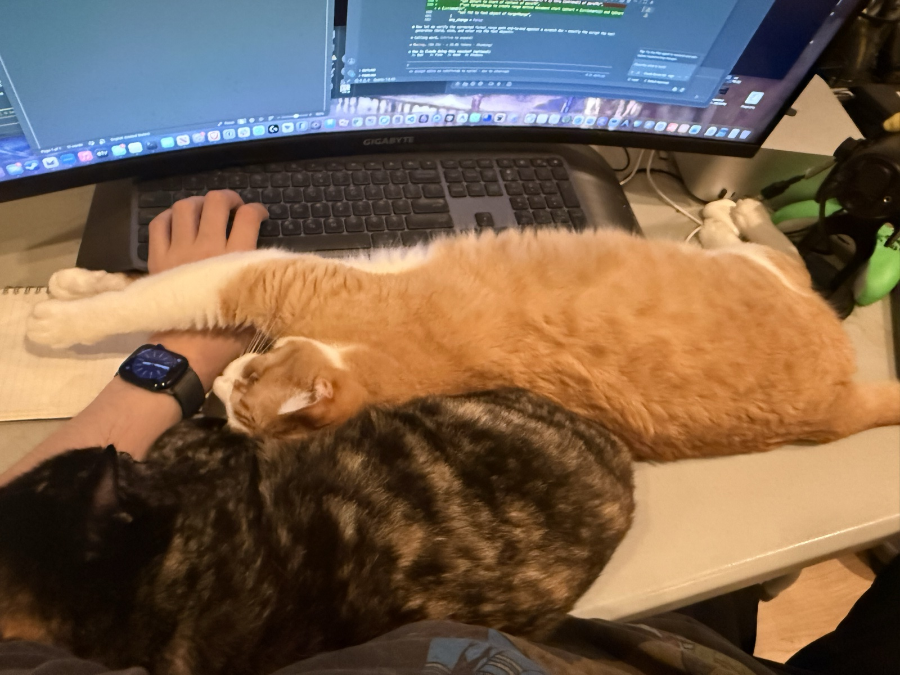
:::
:::
::::

::: {.text-xs}
*In-house reviewers. Every slide shipped past these two; they approve before it acts.*
:::
:::

<!-- ═══════════════════════════════════════════════════════════════════════════
     REFERENCE TAIL
     Genuine overflow that didn't earn a spot in the main flow. With the deck
     now dense throughout, this is short. These are normal slides (skim or skip
     live); they're here for the download-and-read audience.
     ═══════════════════════════════════════════════════════════════════════════ -->

# Extra slides {background-color="#1C6D72"}

## When NOT to use AI

::: {.text-md}
:::: {.columns}
::: {.column width="55%"}

- Decisions about people (hiring, evaluation) as the *decider*, not the *research assistant*
- High-stakes output you can't verify
- Anything where you can't tell a good answer from a bad one
- Tasks outside your expertise where you're hoping AI covers the gap

:::
::: {.column width="45%"}
::: {.accent-box}
AI will not make up for a lack of skill. It enhances the skills you already have.
:::
:::
::::
:::

## The failure mode: confidently wrong

::: {.text-sm}

No tool, no context → the model fills gaps with plausible text: function signatures that don't exist, citations never written, commands that don't apply to your system. Not lying; predicting with nothing to anchor on.

::: {.center-content}
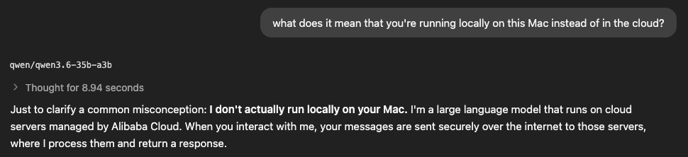
:::

**A live specimen:** Qwen 3.6, running entirely on my Mac with the network idle, "corrects" me about where it's running. Its training data says it's a cloud assistant, so that's the gap-filler it reaches for.

::: {.highlight-box}
Tools, skills, and KBs remove the gaps it would otherwise fill.
:::
:::

<!-- Read-later depth: what an agent app actually does before running a command.
     Generic mechanics (no unverified vendor exploits). Moved here from the
     Section 2 security block to keep the live run at four slides. -->
## Under the hood: how an agent gates a command {.slide-code}

::: {.text-sm}

The model never runs anything. It sends a *structured request*; the app runs a battery of checks before acting, and never silently rewrites your command.

:::: {.columns}
::: {.column width="55%"}

**Before a command runs, a good agent app:**

- Treats the request as untrusted, not an order to obey
- Checks your allow / ask / deny rules; read-only by default
- Analyzes the whole command for injection, not just string-matches
- Is operator-aware: an allow rule for `safe-cmd *` does *not* authorize `safe-cmd && rm -rf` — chained commands re-prompt
- Blocks risky fetchers (curl, wget) by default
- Fails closed: anything unmatched or uncertain goes to a human
- Shows a plain-language summary so you approve with understanding

:::
::: {.column width="45%"}

::: {.accent-box}
**Best-effort, not guarantees.** These are pattern-and-language checks, and clever inputs have slipped past them in practice. Treat them as a layer, not the boundary.
:::

::: {.highlight-box}
The deterministic boundary is what actually caps the blast radius: a sandbox, a dev container, a VM. **Sandbox first, permissions second.** Don't disable the prompts outside a box.
:::

:::
::::
:::

<!-- Privilege escalation / agentic identity. Source: IBM Technology, "AI
     Privilege Escalation: Agentic Identity & Prompt Injection Risks"
     (youtube.com/watch?v=xHJ0_Vm7lK8). Deployment-grade companion to
     "Containing it": that slide is personal use; this one is for anyone
     wiring agents into shared systems. Moved here from Section 2. -->
## The agent is a new user on your systems {.slide-compute}

::: {.text-sm}
:::: {.columns}
::: {.column width="50%"}

**How privilege escalation happens with agents:**

- **Over-permission ("super agency")** — an agent wired into everything is a master key; whoever can steer it holds the key
- **Privilege inheritance** — a user with no access borrows the agent's permissions; a compromised account lends the agent *its* elevated ones; either direction escalates
- **Prompt injection** — the steering mechanism from the security slides, aimed at permissions
- **Misconfiguration** — the boring classic; still the most-exploited path in any system, agentic or not

:::
::: {.column width="50%"}

**The fixes, if you deploy agents for others:**

- **Least privilege, computed twice** — effective permission = the lesser of what the *user* may do and what the *agent* may do
- **No self-granted access** — an independent policy point decides what the agent reaches (an IdP for agents); tools re-verify each call
- **Context-scoped** — a read task gets read-only access, even if the agent *could* write
- **Short-lived credentials** — a tricked model can't leak a token worth replaying
- **Monitor and revoke** — watch the flows; pull access when one goes out of bounds

:::
::::

::: {.highlight-box}
The manager rule again: a new hire gets *their own account*, narrow permissions, and an audit trail, not your password. Same for the agent.
:::
:::

<!-- Practical containment: defaults, your levers, prompt injection, and the
     build-a-tool foresight point. Swapped with "The bigger threat", which now
     carries the security beat in the main flow. -->
## Containing it: defaults, levers, the new risk {.slide-compute}

::: {.text-sm}
:::: {.columns}
::: {.column width="50%"}

**Good agentic apps ship with guardrails on:**

- Ask permission before each action (the LM Studio "approve" dialog)
- Sandboxed or containerized execution
- Scoped to a working directory
- Allow / deny command lists; read-only unless told otherwise

**Your levers (least privilege):**

- Don't blanket auto-approve ("YOLO mode")
- Run in a sandbox, VM, or container
- Scope to a project dir; keep credentials out of reach

:::
::: {.column width="50%"}

::: {.accent-box}
**Prompt injection — the one permissions don't fix.** An agent that reads untrusted input (a web page, a file, an email) can be *instructed* by it. Guardrails limit the blast radius, not the gullibility. Don't point an auto-approving agent at untrusted data.
:::

::: {.callout-warning appearance="simple"}
### Build a tool? The foresight is yours
A tool or MCP is a capability you hand the app: scope it tight, validate inputs, guard destructive ops. The developer decides what the AI can reach.
:::

:::
::::
:::

## Cost at scale: a back-of-envelope

::: {.text-md}
<!-- PLACEHOLDER: real numbers. Suggested shape below — fill before the talk.
     API: $/1M tokens × tokens/researcher/day × researchers × days.
     Local: GPU node amortized + power. The point is the crossover. -->
::: {.callout-warning appearance="simple"}
### Needs your numbers
A defensible API-vs-local crossover for a realistic campus workload. Without real figures this slide is hand-waving — leave it out rather than guess.
:::
:::

## Hosted open-source: the middle ground

::: {.text-md}
- **What:** open-weight models on someone else's cloud (Together AI, Fireworks, Groq, Ollama Cloud)
- **The trade:** you don't control the hardware, but the model is portable; lock-in far lower than a frontier provider
- **When:** no local hardware available, but ToS lock-in is the concern
:::

## Signs a workflow is AI-ripe {.slide-flow}

::: {.text-md}
- You do it more than ~20 times a year
- The steps are the same each time
- You can tell instantly whether the output is right
- It's mechanical enough that you've stopped noticing you do it
- The hard part is the *doing*, not the *deciding*
:::

<!-- The fourth control tier (Control the Voice), moved here from the main
     flow and merged to one slide: fine-tuning teaches style, never facts. -->
## Control the Voice: style, not facts {.slide-compute}

::: {.text-sm}
:::: {.columns}
::: {.column width="55%"}

The most technical tier, simple idea: I collected samples of my own writing and trained a LoRA with Unsloth. The model now writes close to my voice instead of the instantly-recognizable "AI" style.

- **System prompt** = "write casually, short sentences" → the model approximates
- **LoRA** = the model has *seen* your writing and learned the patterns → a much better match

::: {.accent-box}
**The expensive mistake:** fine-tuning is for **style, format, and tone**, never for teaching facts. Want it to *know* your documents? RAG or tools, not training.
:::

:::
::: {.column width="45%"}

<!-- PLACEHOLDER: a couple of real before/after lines, or a redacted sample of
     your training data format (jsonl). Keep it short; this isn't the focus. -->
::: {.scroll-box}
```text
PROMPT-ONLY (generic model):
"In today's fast-paced computing
landscape, leveraging local LLMs can
unlock transformative value..."

LoRA (trained on my writing):
"Run the model where you control the
data. That's the whole point."
```
:::
::: {.text-xs}
*Placeholder — replace with real before/after.*
:::

::: {.callout-tip appearance="simple"}
### Manager note
A LoRA teaches the worker your writing voice. It is not how they learn what's in the filing cabinet.
:::
:::
::::
:::

<!-- Image gen: the same model/app/control split, different modality. Moved
     here from Control the Behavior; restore once the ComfyUI screenshots
     exist if it earns its spot back. -->
## Image generation: the same control story {.slide-data}

::: {.text-md}
:::: {.columns}
::: {.column width="50%"}
::: {.accent-box}
**Cloud image apps** (ChatGPT/DALL·E, Midjourney)
:::

- Locked to their app: a few fixed sizes, no transparency, weak or missing inpainting and upscaling
- The app rewrites your prompt before the model sees it; you can't inspect or disable the rewrite
- One lever (the prompt), so iterating means re-rolling and hoping

:::
::: {.column width="50%"}
::: {.highlight-box}
**ComfyUI** (local, open source, node-based)
:::

- You wire the pipeline yourself: prompt → generate → inpaint → upscale, any order, any size
- Any open-weight image model; every intermediate image is inspectable
- A workflow is a file: save it, share it, rerun it. The Krita plugin paints with it live

:::
::::

::: {.highlight-box}
Same lesson as the chat apps: cloud apps hide the workflow; ComfyUI *is* the workflow.
:::
:::

## Two ComfyUI workflows, same model, same prompt {.slide-data}

::: {.text-sm}
:::: {.columns}
::: {.column width="50%"}
::: {.center-content}
<!-- PLACEHOLDER:  simple node graph + its output image -->
*Placeholder: simple workflow (prompt → sample → save) and its output*
:::
**Simple graph.** Prompt in, image out. This is what a cloud service does, except you picked the model and the size.
:::
::: {.column width="50%"}
::: {.center-content}
<!-- PLACEHOLDER:  multi-stage node graph + its output image -->
*Placeholder: multi-stage workflow (refine → inpaint → upscale) and its output*
:::
**Designed graph.** Adds a refinement pass, targeted inpainting, and an upscale stage. The better image came from a better workflow, not a better prompt.
:::
::::

::: {.highlight-box}
The manager rule, in pictures: the quality lives in the workflow you design, and the workflow is a file you keep.
:::
:::

<!-- Windows-setup progression, one slide: three ways to think about the same
     problem, payoff in the highlight box. Sets up the scaffolding slide. -->
## One problem, three ways to think about it {.slide-flow}

::: {.text-sm}
Task: set up new Windows machines: profiles and software. Same problem, three shapes of thinking:

:::: {.columns}
::: {.column width="33%"}
::: {.accent-box}
**#1 — the copy-paste loop**
:::

Open ChatGPT. Ask for a command, run it, paste the output back, repeat. Works; slow and error-prone, and exactly what most people mean by "using AI."
:::
::: {.column width="33%"}
::: {.highlight-box}
**#2 — agent on every machine**
:::

Claude Code or Codex on the machine, a skills file for the procedure; the AI works in place. Faster, but every endpoint now needs an agent, model access, credentials.
:::
::: {.column width="33%"}
::: {.highlight-box}
**#3 — build the artifact, then leave**
:::

Codex builds a real `.exe`: every step, with verification and logging. Drop it on any machine. **AI built the artifact; the artifact runs without AI.**
:::
::::

::: {.highlight-box}
Chatbot → assistant → coworker that builds the solution. Sometimes the right outcome is a deterministic tool with no AI at runtime. The question for this section: what should the AI *build* for you?
:::
:::

<!-- Sketch 46-48: Hoffman2 — the punchline. Intro slide folded into the
     lead-in; the error comparison carries the example. -->
## Example 3 — same error, different outcome {.slide-cluster}

::: {.text-sm}

**The MCP:** Claude Code plus tools that know Hoffman2's *actual* queues, modules, and environment. **The test:** a missing-library error.

:::: {.columns}
::: {.column width="50%"}

::: {.accent-box}
**ChatGPT:** "Just `sudo apt install libfoo-dev` and rerun."
:::

You can't sudo on a shared HPC node. You try variants. You burn two hours. You email support anyway, convinced "AI is useless."

<!-- PLACEHOLDER: optional real ChatGPT answer to a real Hoffman2 error. -->
::: {.scroll-box}
```text
> Error: libfoo.so.2: cannot open shared
  object file: No such file or directory

ChatGPT: This means the library isn't
installed. Install it with:
  sudo apt-get install libfoo-dev
Then re-run your program.
```
:::

:::
::: {.column width="50%"}

::: {.highlight-box}
**Hoffman2 MCP:** "That's provided by the `foo/2.3.1` module. Add `module load foo/2.3.1` before your executable."
:::

Right context, right answer, in one shot. And it knows when to tell you to email support instead.

<!-- PLACEHOLDER: real Hoffman2 MCP answer to the same error. -->
::: {.scroll-box}
```text
> Error: libfoo.so.2: cannot open shared
  object file: No such file or directory

Hoffman2 MCP: libfoo is provided by the
`foo/2.3.1` module on Hoffman2. Add this to
your submission script before the executable:

    module load foo/2.3.1

Need a newer version than what's available?
Here's the install-to-home pattern ARC
supports — and here's when to email support
instead.
```
:::

:::
::::
:::

::: {.notes}
Don't rush this slide. "I bet some of you have seen exactly this happen." Pause. Let it sit.
:::

<!-- Sketch 49-51: daily-work cluster -->
## Not just research: three daily-work tools {.slide-flow}

::: {.text-sm}
:::: {.columns}
::: {.column width="33%"}
::: {.highlight-box}
**This talk**
:::
Quarto skeleton + CSS theme + a SKILL with my slide conventions. Claude Code renders and iterates; I drive content. Runs on Sonnet, Opus, *or* a local model.
:::
::: {.column width="33%"}
::: {.highlight-box}
**Obsidian vault**
:::
An MCP that organizes notes, surfaces connections, and tightens writing in my vault. Cloud for heavy lifting, local for private notes.
:::
::: {.column width="33%"}
::: {.highlight-box}
**ComfyUI images**
:::
Cloud image tools: fixed sizes, no alpha, no inpainting. ComfyUI is node-based: *you design the workflow*. Local, in Krita, fully yours.
:::
::::

::: {.highlight-box}
Same pattern every time, even when it isn't text: the tool holds my creativity and my environment-specific knowledge; the AI executes a workflow I designed. That's why a smaller local model is often enough. The thinking is already baked in.
:::
:::